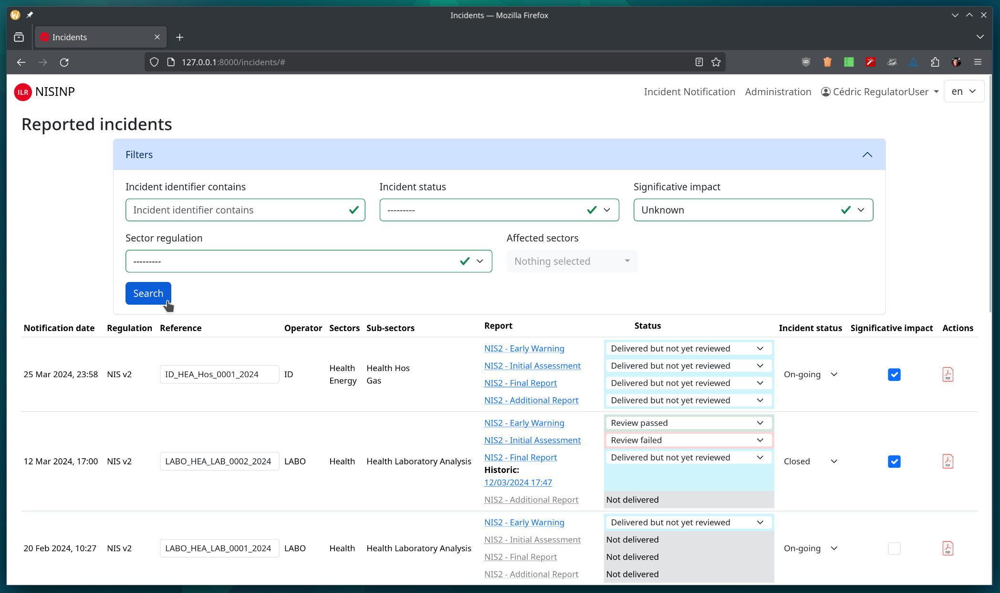

NIS Incident Notification Platform
==================================

.. only:: html

    .. image:: https://img.shields.io/github/release/informed-governance-project/governance-platform.svg?style=flat-square
        :target: https://github.com/informed-governance-project/NISINP/releases/latest
        :alt: Latest release

    .. image:: https://img.shields.io/github/license/informed-governance-project/governance-platform.svg?style=flat-square
        :target: https://www.gnu.org/licenses/agpl-3.0.html
        :alt: License

    .. image:: https://img.shields.io/github/stars/informed-governance-project/governance-platform.svg?style=flat-square
        :target: https://github.com/informed-governance-project/NISINP/stargazers
        :alt: Stars

    .. image:: https://github.com/informed-governance-project/NISINP/workflows/Python%20application%20tests/badge.svg?style=flat-square
        :target: https://github.com/informed-governance-project/NISINP/actions?query=workflow%3A%22Python+application+tests%22
        :alt: Workflow

    .. image:: https://readthedocs.org/projects/nisinp/badge/?version=latest
        :target: https://nisinp.readthedocs.io/en/latest/?badge=latest
        :alt: Documentation Status

.. toctree::
   :caption: Technical considerations
   :maxdepth: 3
   :hidden:

   prerequisites
   installation
   update
   modules
   architecture
   api-v1

.. toctree::
   :caption: Conceptual considerations
   :maxdepth: 3
   :hidden:

   security
   permissions

.. toctree::
   :caption: User interface
   :maxdepth: 3
   :hidden:

Presentation
------------

The Incident Notification Platform is developed and maintained by
`NC3-LU <https://github.com/NC3-LU>`_ team in the framework of the
`Informed Governance Project <https://github.com/informed-governance-project>`_.

The platform is dedicated to national regulators and Operators of Essential Services
(Energy, Transport, etc.) in the context of
`NIS 2 <https://www.europarl.europa.eu/thinktank/en/document/EPRS_BRI(2021)689333>`_.
Different regulations are supported.

This project is lead by `NC3-LU <https://www.nc3.lu>`_.
Developed in partnership with `ILR.lu <https://web.irl.lu>`_ and
`NC3-LU <https://www.ibpt.be>`_.

   Screenshot of the list of incidents from the regulator view.

This document is intended to be a documentation for operators and users of the platform.
If you find errors or omission, please don't hesitate to submit
`an issue <https://github.com/informed-governance-project/NISINP/issues/new?labels=documentation&template=bug_report.md>`_
or open a pull request with a fix.

Contact
-------

`NC3 Luxembourg <https://www.nc3.lu>`_ - `info@nc3.lu <info@nc3.lu>`_

License
-------

The Governance Platform is licensed under
`GNU Affero General Public License version 3 <https://www.gnu.org/licenses/agpl-3.0.html>`_.

- Copyright (C) 2023-2024 Cédric Bonhomme <cedric.bonhomme@nc3.lu>
- Copyright (C) 2023-2024 Jérôme Lombardi <jerome.lombardi@nc3.lu>
- Copyright (C) 2023-2024 Juan Rocha <juan.rocha@nc3.lu>
- Copyright (C) 2023-2024 `NC3 Luxembourg <https://www.nc3.lu>`_
- Copyright (C) 2023-2024 Ruslan Baidan <ruslan.baidan@nc3.lu>
