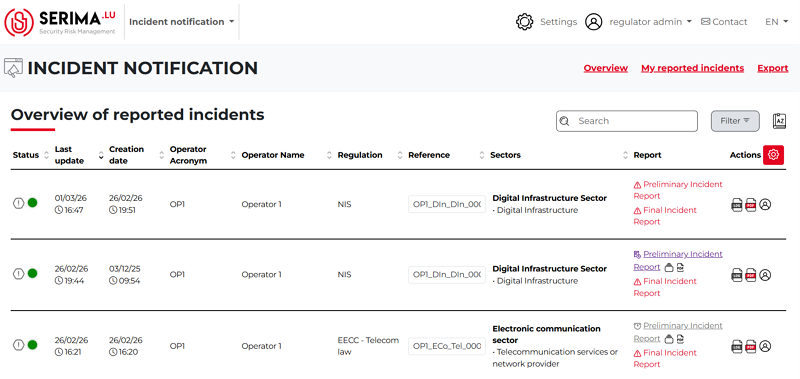

Incident Notification Module
==================================

.. only:: html

    .. image:: https://img.shields.io/github/release/informed-governance-project/governance-platform.svg?style=flat-square
        :target: https://github.com/informed-governance-project/NISINP/releases/latest
        :alt: Latest release

    .. image:: https://img.shields.io/github/license/informed-governance-project/governance-platform.svg?style=flat-square
        :target: https://www.gnu.org/licenses/agpl-3.0.html
        :alt: License

    .. image:: https://img.shields.io/github/stars/informed-governance-project/governance-platform.svg?style=flat-square
        :target: https://github.com/informed-governance-project/NISINP/stargazers
        :alt: Stars

    .. image:: https://github.com/informed-governance-project/NISINP/workflows/Python%20application%20tests/badge.svg?style=flat-square
        :target: https://github.com/informed-governance-project/NISINP/actions?query=workflow%3A%22Python+application+tests%22
        :alt: Workflow

    .. image:: https://readthedocs.org/projects/nisinp/badge/?version=latest
        :target: https://nisinp.readthedocs.io/en/latest/?badge=latest
        :alt: Documentation Status

.. toctree::
   :caption: Technical considerations
   :maxdepth: 3
   :hidden:

   prerequisites
   installation
   update
   modules
   architecture
   api-v1
   exemple

.. toctree::
   :caption: Conceptual considerations
   :maxdepth: 3
   :hidden:

   security
   permissions

.. toctree::
   :caption: Application interface
   :maxdepth: 3
   :hidden:

   ui_user
   ui_administrator
   ui_platformadmin

.. toctree::
   :caption: User Manual
   :maxdepth: 3
   :hidden:

   ui_introduction
   ui_login page
   ui_create an account
   ui_enable 2FA
   ui_parts of the homepage
   ui_incident notification dashboard
   ui_how to report an incident?
   ui_reported incidents view
   ui_incident reporting workflow - operator admin
   ui_incident reporting workflow - regulator admin
   ui_security objectives dashboard
   ui_how to submit a security objective?
   ui_how does the score system work?
   ui_security objectives workflow - operator admin
   ui_security objectives workflow - regulator admin

.. toctree::
   :caption: Administration interface
   :maxdepth: 3
   :hidden:

   ui_introduction
   ui_operator admin
   ui_regulator user
   ui_regulator admin
   ui_platform admin

Presentation
------------

The Incident Notification Module is developed and maintained by the
`NC3-LU <https://github.com/NC3-LU>`_ team in the framework of the
`Informed Governance Project <https://github.com/informed-governance-project>`_.

The incident notification module is designed to serve as a national incident reporting tool. 
It is multi-regulator, meaning that any regulator or competent authority in the country can use it and receive incident notifications. 

It is also multi-regulation, meaning that it is fully configurable, and each regulator is responsible for configuring the regulations for which they are accountable.
Operators under supervision can use the module to submit their incident notifications.

This project is lead by `NC3-LU <https://www.nc3.lu>`__ and developed in partnership with `ILR.lu <https://web.ilr.lu>`_ and
`IBPT.be <https://www.ibpt.be>`_.

   Screenshot of the list of incidents from the regulator view.

This document is intended to be a documentation for operators and users of the module.
If you find errors or omission, please don't hesitate to submit
`an issue <https://github.com/informed-governance-project/NISINP/issues/new?labels=documentation&template=bug_report.md>`_
or open a pull request with a fix.

Contact
-------

`NC3 Luxembourg <https://www.nc3.lu>`_ - `info@nc3.lu <info@nc3.lu>`_

License
-------

The Governance Platform is licensed under
`GNU Affero General Public License version 3 <https://www.gnu.org/licenses/agpl-3.0.html>`_.

- Copyright (C) 2023-2024 Cédric Bonhomme <cedric.bonhomme@nc3.lu>
- Copyright (C) 2023-2024 Jérôme Lombardi <jerome.lombardi@nc3.lu>
- Copyright (C) 2023-2024 Juan Rocha <juan.rocha@nc3.lu>
- Copyright (C) 2023-2024 `NC3 Luxembourg <https://www.nc3.lu>`_
- Copyright (C) 2023-2024 Ruslan Baidan <ruslan.baidan@nc3.lu>
