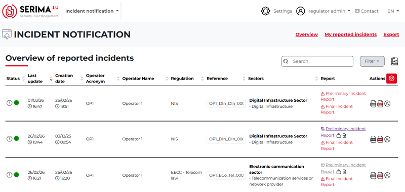

Incident Notification Module
==================================

.. only:: html

    .. image:: https://img.shields.io/github/release/informed-governance-project/governance-platform.svg?style=flat-square
        :target: https://github.com/informed-governance-project/SERIMA/releases/latest
        :alt: Latest release

    .. image:: https://img.shields.io/github/license/informed-governance-project/governance-platform.svg?style=flat-square
        :target: https://www.gnu.org/licenses/agpl-3.0.html
        :alt: License

    .. image:: https://img.shields.io/github/stars/informed-governance-project/governance-platform.svg?style=flat-square
        :target: https://github.com/informed-governance-project/SERIMA/stargazers
        :alt: Stars

    .. image:: https://github.com/informed-governance-project/SERIMA/workflows/Python%20application%20tests/badge.svg?style=flat-square
        :target: https://github.com/informed-governance-project/SERIMA/actions?query=workflow%3A%22Python+application+tests%22
        :alt: Workflow

    .. image:: https://readthedocs.org/projects/serima/badge/?version=latest
        :target: https://serima.readthedocs.io/en/latest/?badge=latest
        :alt: Documentation Status

.. toctree::
   :caption: Technical considerations
   :maxdepth: 3
   :hidden:

   prerequisites
   installation
   update
   modules
   architecture

.. toctree::
   :caption: Conceptual considerations
   :maxdepth: 3
   :hidden:

   security
   permissions

.. toctree::
   :caption: User Manual
   :maxdepth: 3
   :hidden:

   ui_introduction
   ui_login_page
   ui_create_an_account
   ui_enable_2FA
   ui_parts_of_the_homepage
   ui_incident_notification_dashboard
   ui_how_to_report_an_incident
   ui_reported_incidents_view
   ui_incident_reporting_workflow_operator_admin
   ui_incident_reporting_workflow_regulator_admin
   ui_security_objectives_dashboard
   ui_how_to_submit_a_security_objective
   ui_security_objectives_workflow_score_system
   ui_security_objectives_workflow_operator_admin
   ui_security_objectives_workflow_regulator_admin

.. toctree::
   :caption: Administration interface
   :maxdepth: 3
   :hidden:

   ui_admin_introduction
   ui_operator_admin
   ui_regulator_user
   ui_regulator_admin/index
   ui_platform_admin/index

.. toctree::
   :caption: Reporting module
   :maxdepth: 3
   :hidden:

   ui_reporting_module/ui_introduction
   ui_reporting_module/ui_homepage
   ui_reporting_module/ui_reporting_dashboard
   ui_reporting_module/ui_managing_dashboard
   ui_reporting_module/ui_create_project
   ui_reporting_module/ui_open_project
   ui_reporting_module/ui_edit_project
   ui_reporting_module/ui_duplicate_project
   ui_reporting_module/ui_delete_project
   ui_reporting_module/ui_import
   ui_reporting_module/ui_generate_and download_report
   ui_reporting_module/ui_report_back_end
   ui_reporting_module/ui_bulk_report_and_error_log

Presentation
------------

The Incident Notification Module is developed and maintained by the
`NC3-LU <https://github.com/NC3-LU>`_ team in the framework of the
`Informed Governance Project <https://github.com/informed-governance-project>`_.

The incident notification module is designed to serve as a national incident reporting tool.
It is multi-regulator, meaning that any regulator or competent authority in the country can use it and receive incident notifications.

It is also multi-regulation, meaning that it is fully configurable, and each regulator is responsible for configuring the regulations for which they are accountable.
Operators under supervision can use the module to submit their incident notifications.

This project is lead by `NC3-LU <https://www.nc3.lu>`__ and developed in partnership with `ILR.lu <https://web.ilr.lu>`_ and
`IBPT.be <https://www.ibpt.be>`_.

   Screenshot of the list of incidents from the regulator view.

This document is intended to be a documentation for operators and users of the module.
If you find errors or omission, please don't hesitate to submit
`an issue <https://github.com/informed-governance-project/SERIMA/issues/new?labels=documentation&template=bug_report.md>`_
or open a pull request with a fix.

Contact
-------

`NC3 Luxembourg <https://www.nc3.lu>`_ - `info@nc3.lu <info@nc3.lu>`_

License
-------

The Governance Platform is licensed under
`GNU Affero General Public License version 3 <https://www.gnu.org/licenses/agpl-3.0.html>`_.

- Copyright (C) 2023-2026 Cédric Bonhomme <cedric.bonhomme@nc3.lu>
- Copyright (C) 2023-2026 Jérôme Lombardi <jerome.lombardi@nc3.lu>
- Copyright (C) 2023-2026 Juan Rocha <juan.rocha@nc3.lu>
- Copyright (C) 2023-2026 `NC3 Luxembourg <https://www.nc3.lu>`_
- Copyright (C) 2023-2026 Ruslan Baidan <ruslan.baidan@nc3.lu>
