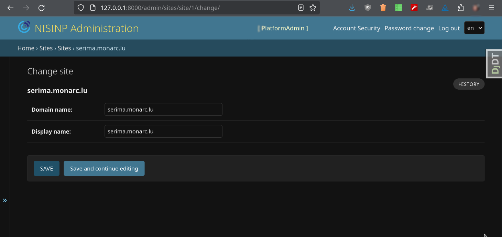

Installation
============

This section covers the installation steps of the sofware.

Containerized installation
--------------------------

You can, optionnally, create a LXC container.

.. code-block:: bash

    $ lxc launch ubuntu:23.10 NISINP --storage your-storage
    $ lxc exec NISINP -- /bin/bash


Poetry
------

.. code-block:: bash

    $ curl -sSL https://install.python-poetry.org | python3 -


at the end of the `~/.bashrc` file add the line:

.. code-block:: bash

    $ export PATH="/root/.local/bin:$PATH"


PostgreSQL
----------

Install PostgreSQL, the version provided by default for your
GNU/Linux distribution.

.. code-block:: bash

    $ sudo apt-get install postgresql
    $ sudo su postgres
    $ psql
    $ /password postgres
    # password


Create a database, database user:

.. code-block:: bash

    $ sudo -u postgres createuser <username>
    $ sudo -u postgres createdb <database>
    $ sudo -u postgres psql
    psql (15.6 (Debian 15.6-0+deb12u1))
    Type "help" for help.
    postgres=# alter user <username> with encrypted password '<password>';
    ALTER ROLE
    postgres=# grant all privileges on database <database> to <username>;
    GRANT
    postgres=#


NISINP
------

.. code-block:: bash

    git clone https://github.com/informed-governance-project/NISINP.git
    cd NISINP
    git submodule update --init --recursive
    npm install
    # Copy the config and adjust the DB connection and the other settings:
    cp governanceplatform/config_dev.py governanceplatform/config.py
    poetry install
    poetry shell
    python manage.py migrate
    python manage.py collectstatic
    poetry manage.py compilemessages
    python manage.py createsuperuser


Theme
`````

In this case, the theme (CSS, icons, etc.) of the sofware will be under the ``theme`` folder as a Git submodule.
You can replace it by your own. Currently two themes are available:

- https://github.com/informed-governance-project/default-theme (default theme, used for ILR Luxembourg)
- https://github.com/informed-governance-project/serimabe-theme (theme for IBPT.be)

If you do not want to use the default theme, do not clone the main repository with the submodule.


Configuration
`````````````

In the configuration file ``governanceplatform/config.py`` , ensures that you have configured:

- ``PUBLIC_URL``
- ``ALLOWED_HOSTS``
- ``OPERATOR_CONTACT`` and ``REGULATOR_CONTACT``
- ``DATABASES``
- ``HASH_KEY`` and ``SECRET_KEY``
- ``DEBUG``: must be set to ``False`` in a production environment
- ``CSRF_TRUSTED_ORIGINS``
- ``EMAIL_SENDER``
- etc.

You **must really** set **your** secret keys.

Here is an example for the Fernet hash key (``HASH_KEY``):

.. code-block:: bash

    $ python -c 'from cryptography.fernet import Fernet; print(Fernet.generate_key())'
    b'Xaj5lFGAPiy2Ovzi4YmlWh-s4HHikFV4AswilOPPYN8='


For the Django secret key (``SECRET_KEY``), you can for example do:

.. code-block:: bash

    $ python -c 'import secrets; print(secrets.token_hex())'
    9cf5c7b13e469e6f6a9403b33410589031cfe927df6471a1cbdef1d4deb57c37


Create the PlatformAdmin user
-----------------------------

.. code-block:: bash

    $ python manage.py createsuperuser

This user will be able to create RegulatorAmin users via the Web interface
of NISINP.

The first PlatformAdmin user will also have to configure the ``domain name``
and ``display name`` of the application:




   Django application - Sites configuration.


This step is essential for ensuring the proper functioning of the platform's email sending,
such as for password recovery purposes, as well as for generating QR codes for
two-factor authentication (2FA).


Launch the Django application
-----------------------------

.. code-block:: bash

    poetry run python manage.py runserver 127.0.0.1:8000

Of course, do not do that for a production environment.


Scheduled tasks
---------------

Configure the cron tasks:

.. code-block:: bash

    0 * * * * cd /<-application-path->/NISINP/  ; python manage.py runscript workflow_update_status
    0 * * * * cd /<-application-path->/NISINP/  ; python manage.py runscript email_reminder

The best is to use the Python executable in the virtual environment.


Apache
------

The mod_wsgi package provides an Apache module that implements a WSGI compliant
interface for hosting Python based web applications on top of the Apache web
server.

For the next steps you must have a valid domain name.


Example of VirtualHost configuration file
`````````````````````````````````````````

Only in the case you can not use the version of mod_wsgi from your
GNU/Linux distribution.


.. code-block:: bash

    $ sudo apt install apache2 apache2-dev # apxs2
    $ wget https://github.com/GrahamDumpleton/mod_wsgi/archive/refs/tags/5.0.0.tar.gz
    $ tar -xzvf 5.0.0.tar.gz
    $ cd mod_wsgi-5.0.0/
    $ ./configure --with-apxs=/usr/bin/apxs2 --with-python=/home/<user>/.pyenv/shims/python
    $ make
    $ sudo make install


Then in ``/etc/apache2/apache2.conf`` add the lines:

.. code-block:: bash

    LoadFile /home/<user>/.pyenv/versions/3.11.0/lib/libpython3.11.so
    LoadModule wsgi_module /usr/lib/apache2/modules/mod_wsgi.so


Restart Apache:

.. code-block:: bash

    sudo systemctl restart apache2.service


Example of a VirtualHost for a reverse proxy server:


.. code-block:: apacheconf

    <VirtualHost *:80>
        ServerAdmin info@incidents.serima.lu
        ServerName incidents.serima.lu

        DocumentRoot /var/www/html
        RewriteEngine on
        RewriteRule ^ https://%{SERVER_NAME}%{REQUEST_URI} [END,NE,R=permanent]
    </VirtualHost>

    <VirtualHost *:443>
        ServerAdmin info@incidents.serima.lu
        DocumentRoot /var/www/html
        ServerName incidents.serima.lu

        # main configuration
        RewriteEngine On
        RewriteCond %{REQUEST_METHOD} !^(GET|POST|PUT|PATCH|DELETE|HEAD)
        RewriteRule .* - [R=405,L]

        SSLProxyEngine On
        ProxyPreserveHost On
        ProxyTimeout 1800

        CustomLog ${APACHE_LOG_DIR}/incidents.serima.lu_access.log combined
        ErrorLog ${APACHE_LOG_DIR}/incidents.serima.lu_error.log

        SSLEngine on
        SSLCertificateFile /etc/ssl/private/incidents_serima_lu/incidents_serima_lu.cer
        SSLCertificateChainFile /etc/ssl/private/incidents_serima_lu/incidents_serima_lu_interm.cer
        SSLCertificateKeyFile /etc/ssl/private/incidents_serima_lu/incidents.serima_lu.key

        ProxyPass / http://web01.private.serima.lu/
        ProxyPassReverse / http://web01.private.serima.lu/
    </VirtualHost>


Then configure HTTPS properly. If you want to user Let's Encrypt:

.. code-block:: bash

    sudo apt install certbot python3-certbot-apache
    sudo certbot certonly --standalone -d incidents.serima.lu
    sudo a2enmod rewrite
    sudo systemctl restart apache2.service


Example of a VirtualHost for the application:

.. code-block:: apacheconf

    <VirtualHost *:80>
        ServerName web01.private.serima.lu
        ServerAdmin info@incidents.serima.lu

        WSGIDaemonProcess serima python-path=/home/USER/NISINP:/home/USER/.cache/pypoetry/virtualenvs/governanceplatform-AGxECetm-py3.10/lib/python3.10/site-packages/
        WSGIProcessGroup serima
        WSGIScriptAlias / /home/USER/NISINP/governanceplatform/wsgi.py

        <Directory "/home/USER/NISINP/governanceplatform/">
            <Files "wsgi.py">
                Require all granted
            </Files>
            WSGIApplicationGroup %{GLOBAL}
            WSGIPassAuthorization On

            Options Indexes FollowSymLinks
            Require all granted
        </Directory>

        Alias /static /home/USER/NISINP/governanceplatform/static
        <Directory /home/USER/NISINP/static>
            Require all granted
        </Directory>

        # Available loglevels: trace8, ..., trace1, debug, info, notice, warn,
        # error, crit, alert, emerg.
        # It is also possible to configure the loglevel for particular
        # modules, e.g.
        LogLevel warn
        CustomLog ${APACHE_LOG_DIR}/incidents.serima.lu_access.log combined
        ErrorLog ${APACHE_LOG_DIR}/incidents.serima.lu_error.log
    </VirtualHost>
