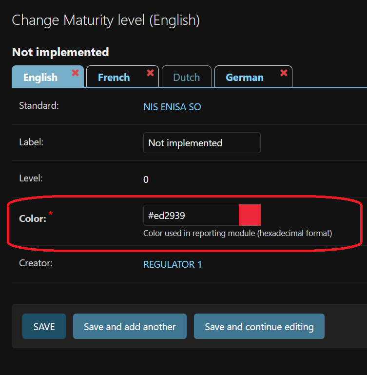
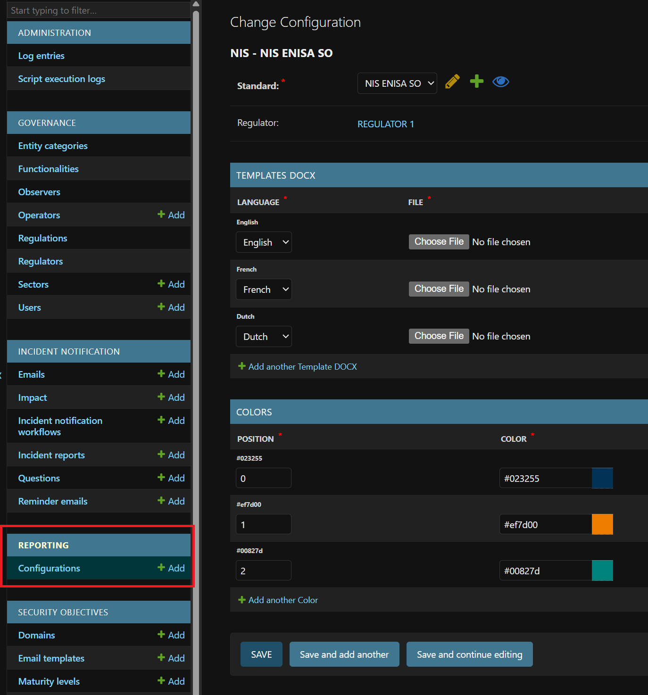
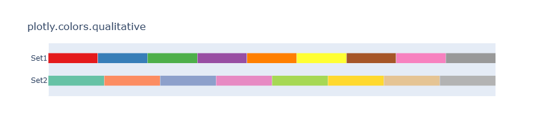

Administration Settings [**Regulator Admin**]
~~~~~~~~~~~~~~~~~~~~~~~~~~~~~~~~~~~~~~~~~~~~~~~~

Security Objectives Maturity Levels
^^^^^^^^^^^^^^^^^^^^^^^^^^^^^^^^^^^^

Define a color (in **HEX format**) for each maturity level. By default is ``#FFFFFF``

   Maturity level configuration

**Example:**

::

   #ed2939, #ffc000, #dde96d, #00b050

Reporting Configuration
^^^^^^^^^^^^^^^^^^^^^^^^

Configure reporting settings for each **Security Standard**

   Reporting configuration

- A :ref:`DOCX_template` must be provided for each supported language.
- Define a **color palette** used in chart series.

By default, the following palette is applied:

::

   plotly.colors.qualitative.Set1 + Set2

   Default palette used for charts.

.. _DOCX_template:

DOCX Template
~~~~~~~~~~~~~

A sample DOCX template is available for testing:

- :download:`DOCX template <_static/docx_test_template.docx>`
- :download:`Rendered report example <_static/docx_test_template_rendered.docx>`

**Available Placeholder Tags**

The following placeholders can be used inside the DOCX template.

1. **Context Tags**

These tags are replaced with contextual data:

- ``{{ operator_name }}``
- ``{{ sector }}``
- ``{{ year }}``
- ``{{ publication_date }}``
- ``{{ threshold_for_high_risk }}``
- ``{{ top_ranking }}``

2. **Chart Tags**

Use these placeholders to insert charts:

- ``{{ chart_security_objectives_by_level }}``
- ``{{ chart_evolution_security_objectives_by_domain }}``
- ``{{ chart_evolution_security_objectives_by_domain_with_sector_avg }}``
- ``{{ chart_evolution_security_objectives }}``
- ``{{ chart_average_risk_level }}``
- ``{{ chart_high_risk_rate }}``
- ``{{ chart_average_high_risk_level }}``
- ``{{ chart_evolution_highest_risks }}``

3. **Table Tags**

Use these placeholders to insert tables:

- ``{{ table_of_evolution_security_objectives }}``
- ``{{ table_of_evolution_security_objectives_by_domain }}``
- ``{{ table_of_highest_security_objectives_in_the_sector }}``
- ``{{ table_of_lowest_security_objectives_in_the_sector }}``
- ``{{ table_of_evolution_of_the_weakest_security_objectives }}``
- ``{{ table_of_security_objectives_by_maturity_level }}``
- ``{{ maturity_level_legend }}``
- ``{{ table_of_evolution_of_the_highest_risks }}``
- ``{{ table_of_treatment_of_the_highest_risks }}``
- ``{{ table_of_risk_summary }}``
- ``{{ table_of_top_threats_by_occurrence }}``
- ``{{ table_of_top_vulnerabilities_by_occurrence }}``
- ``{{ table_of_recommendations }}``
