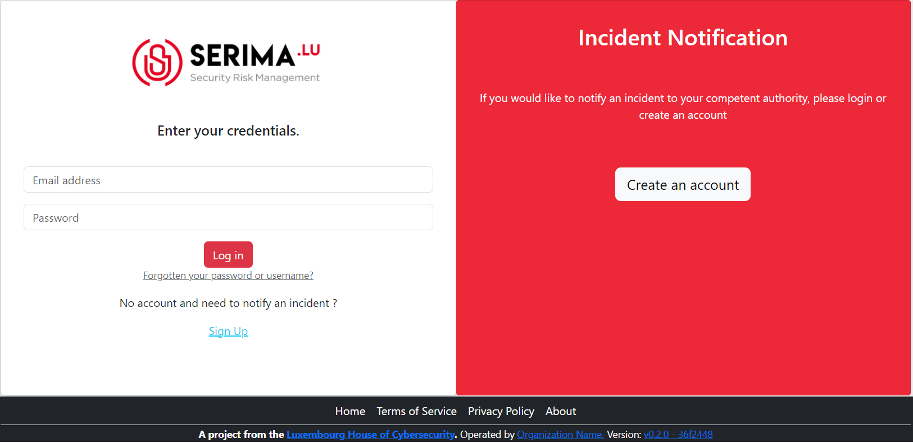
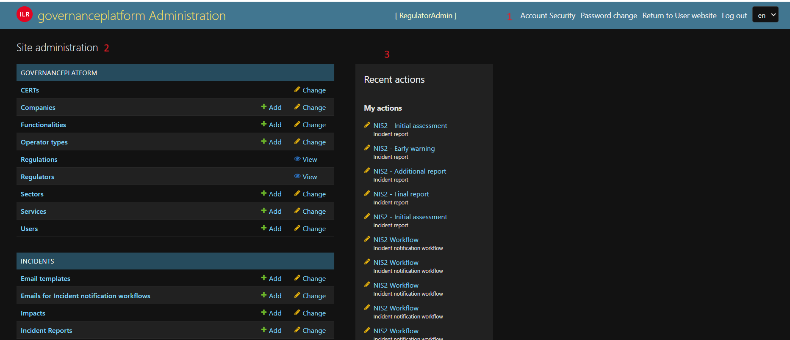
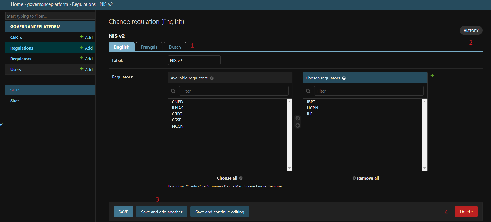

Administrator interface
=========================

log-in
-------

On this page you can log in or create an account in case you have to notify an incident and you don't have your credential.

   Screenshot of the login page.

If you have credentials and don't remember the password please use the link: 'Forgotten your password or username?'

At the first login, you need to activate the 2FA.

Access to the administrator page
-----------------------------------

The following roles have access to the administrator interface:

- PlatformAdmin : create regulation, regulators, observers
- RegulatorAdmin : create the workflows for incidents, RegulatorUser for its regulator
- RegulatorUser : create companies
- OperatorAdmin : create OperatorUser for its company
- ObserverAdmin : create ObserverUser for its Observer entity

   Screenshot of an administrator page.

The administrator page is composed of 3 parts:

1. The navigation bar where you can change your account settings, language, also leaves the website and return on the user interface
2. A list of modules you have access and things you can modify, see, or delete
3. A list of your recent changes on the application

Standard list view
---------------------

When clicking on an entity for example "Impacts" here, you list all the objects and you have different possible actions.

.. figure:: _static/ui_standard_list.png
   :alt: edit page.
   :target: _static/ui_standard_list.png

   Screenshot of a list page.

1. For some entities, you can import/export in several formats (JSON, CSV, etc.)
2. For some entities, you can filter the list depending of its attributes
3. It's also possible to limit the number of displayed items with the search bar
4. Some group actions are also available, for that you need to tick the case corresponding to the entries you want to modify and select the appropriate action

Standard add / change function
-----------------------------------

When clicking on add or editing an object, you arrive on this kind of view for all the objects. The difference between editing and adding is in editing mode, the values are prefilled by the existing one

   Screenshot of an edition page.

1. You can change the language of the object, be informed that you always need to fill the fallback language. **Be aware that you need to save each language separately**. So, if you want to save the 3 languages in one step use the "save and continue editing"
2. In case of editions you can see the history of the object (all the modifications done)
3. Different possibilities to save the object
4. In case of editing you can also delete the object. If you choose to delete the object, a confirmation message will be shown with the impacts on other entities

Creation of workflow for incident notification
-------------------------------------------------

The RegulatorAdmin role is the one who defines the workflows for incident notification.

Here, the standard way to create a workflow:

1.   You have to create first an item called ``incident notification workflow`` (e.g. NIS2, etc.).

2.   You have to create the different steps of your workflow. The steps are called ``incident reports`` (e.g. Early Warning, initial assessment, etc.).

3.   Now you have to link ``incident reports`` with  ``incident notification workflow``, for that go on ``incident notification workflow`` and choose the incident reports. The position defines the sequence of apparition.

4.   For each incident report you have to create ``questions``. A question belongs to a ``question category``. The  ``question category`` can be created directly in the question form. You have to create the category only one time, after you can reuse it. 

   .. note:: The ``question category`` helps for the rendering of the form for the user who submits the notification. There are different types of question, some types of question (e.g. Multiple choice, Single choice, etc.) can have ``predefined answers``. 

   .. caution::  **It's important to use one answer only for one question**. You can create the predefined answer directly in the question form.**If you want to translate in several language, you must first fill one language, click on "save and continue editing" and go to the other language, if you don't do that you will loose the content for the predefined answer**.

5.   Your incident workflow is now done.

In addition to that there is an emailing system. The structure of the email has to be defined in the ``Email templates`` entity. Each email has a name, subject, and content.
The content can be personalized with data from the database, for that you need to include the following tag:

- #INCIDENT_NOTIFICATION_DATE# : first notification of the incident
- #INCIDENT_DETECTION_DATE# : detection date of the incident
- #INCIDENT_STARTING_DATE#: starting date of the incident
- #INCIDENT_ID# : reference of the incident

Each ``incident notification workflow`` has:

- opening email : Email sent when the incident is created
- closing email : email sent when the incident is closed (by the regulator)
- Report status changed email : when there is a change in the lifecycle of the incident, for example a submission of a new report.

The three elements above reference an ``Email template`` that has to be defined.

Those email can be completed by the ``Emails for incident notification workflows``. For each incident reports (e.g. Early Warning), it's possible to send other emails
like reminder, for that in the ``Emails for incident notification workflows`` you can define emails which are sent with delay, the delay can start from the Notification Date of the report
or the date of the previous incident report.

For each couple regulation/sector(s), it's possible to define an ``impact``, the impacts are here to qualify the incident as significative. If one impact is ticked by the
person who submits the incident, the incident is qualified as "significative".

.. Export and import
.. ------------------

.. Some model of the application can be exported and/or imported. The import / export is done **language by language**. So, if you want to export in two languages, you have to do
.. 2 exports. Same for the import.

.. .. figure:: _static/ui_admin_export.png
..    :alt: import / export.
..    :target: _static/ui_admin_export.png

..    Import export.

.. 1. Button to import. When you click on import, you can choose the format of your file. And the view displayed you the available field to import. **If you want to create, it's preferable to don't put the id field**.
.. After clicking on that button, you have to select the file and the format (e.g. xlsx) and click on submit. **Take care of choosing the right language, it will import in the language you have chosen**.
.. After that you have this view :

.. .. figure:: _static/ui_admin_import.png
..    :alt: import view.
..    :target: _static/ui_admin_import.png

..    Import view.

.. This view is summarizing the import, you can see the change.

.. 2. Button to export, when you export, the result of the export is the list which is displayed on the page. So you can reduce the list by searching or using a filter on the page if there are some available.
.. After clicking on it, you can choose the format, the easiest is to choose ``xlsx``.

.. 3. Search bar to reduce the exported list.

Questions of incident report
~~~~~~~~~~~~~~~~~~~~~~~~~~~~~~

To import or export question you need three models : ``predefined answers, question categories, questions``

For importing you need to import in this order:

1. Question categories
2. Questions
3. Predefined answers

If you want to create from scratch, you have to create a file of ``question categories`` mentioning:

- ``label`` : the name of the category

- ``position`` : position of the category, lower positions are shown in first during the incident report

After you have to import the ``questions``:

- ``label`` : The question itself
- ``tooltip`` : If the question needs a tooltip
- ``question_type`` : The type of the question, there are several types :
   - MULTI - multiple choice,
   - FREETEXT - free text question,
   - SO - single option choice,
   - MT - multiple choice and free text,
   - ST - single choice and free text,
   - CL - Country list,
   - RL - Region list,
   - DATE - a date picker question.
- ``is_mandatory`` : if the question is mandatory, put True, if not put False
- ``position`` : position of the question inside the category, lower positions are shown in first during the incident report
- ``category`` : label of the category in the language you want to import

After you have to import the ``predefined answers``:

- ``predefined_answer`` : The answer, for exemple Yes for a Yes/No question.
- ``question`` : The label of the question in the language you want to import
- ``position`` : position of the answer, lower positions are shown in first during the incident report

You have now your database in one language if you want to import other language, you can now export the model (e.g. questions, question categories, etc.) you want to translate to get the IDs.
You have to follow the same procedure than before but putting the id to the file to have an update instead of a creation. And remember to **import in the right language**.

Sectors
~~~~~~~~

For importing sectors you need to respect the following rules:

- If your sector has a parent, **please put the parent before** in the file, the parent has to be imported before
- If there is no parent, **don't let the field blank**, put ``NULL`` or ``-`` into the field. Blank field raise errors

The fields are:

- ``parent`` : the sector above (name in the same language)
- ``name`` : the name of the sector
- ``acronym`` : acronym for the sector, used for the incident reference

To update fields, for example, to update translations you need to export first to have the id and put the id field into the file.

Impacts
~~~~~~~~

For importing impacts, all the reffered elements (regulation and sectors) should be present in the system.

The fields are:

- ``regulation`` : the regulation affected by the impact
- ``label`` : description of the impact
- ``headline`` : headline of the impacts
- ``sectors`` : name of the sectors, to link the impact to one or several sectors, **|** is the separator

To update fields, for example, to update translations you need to export first to have the id and put the id field into the file.

Companies
~~~~~~~~~~

The fields are the following:

- ``identifier`` : 4 digits identifier of the company
- ``name`` : Name of the company
- ``address`` : Address of the company
- ``country`` : 2 letters country code following the ISO 3166-2. for exemple FR for France
- ``email`` : generic email of the company
- ``phone_number`` : generic phone number of the company, for exemple +1 212-555-2368

Users
~~~~~~~~

For importing users you need first to import the company or companies, they are linked and sector(s). You can only import ``OperatorUser``, ``OperatorAdmin``, ``IncidentUser``.

The system can't tolerate two users with the same email address.

The fields are the following:

- ``firstname`` : first name of the user
- ``lastname`` : last name of the user
- ``email`` : email of the users, it's the pivot to update a user
- ``phone_number`` : phone number of the user, for exemple +1 212-555-2368
- ``sectors`` : sectors linked to the user. Company(ies) have to be present. If they are not present sectors are ignored
- ``companies`` : companies linked to the user. Sector(s) have to be present. if they are not present companies are ignored
- ``administrator`` : True if the user has to be an administrator of the company else False.

By default user without companies and sectors are categorized as ``IncidentUser``.
