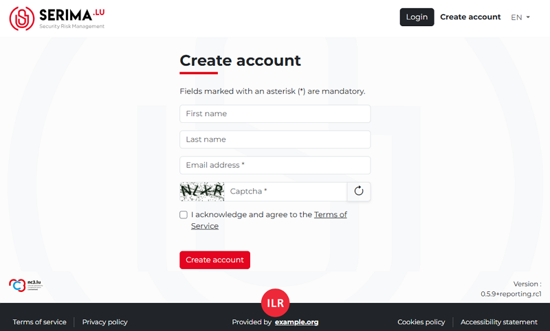
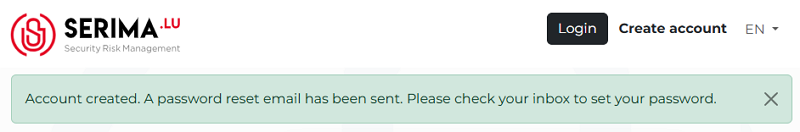
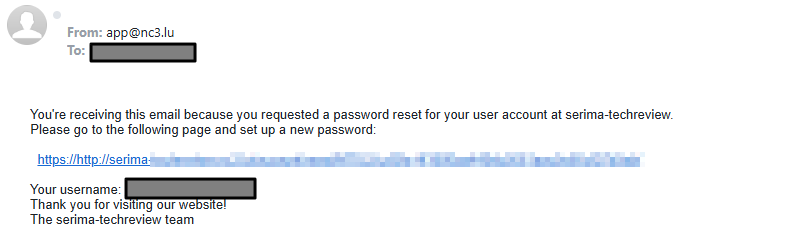

Create an account
-------------------------

If you do not have an account yet, create one by using the **Report an incident without account** button in the centre
or by clicking the **Create account** link in the top right corner.
Populate the required fields and provide a password you would like to use.

After you complete the required fields and accept the terms of service,
you will receive an email, and the following message will appear on the **SERIMA** platform.

Open your email received from the SERIMA platform and click the activation link:

**Please note that the following password restrictions apply:**

-	Your password can't be too similar to your other personal information.
-	Your password must contain at least 8 characters.
-	Your password can't be commonly used.
-	Your password can't be entirely numeric.
-	Your password must not match any previously used passwords.
