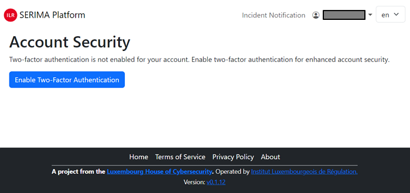
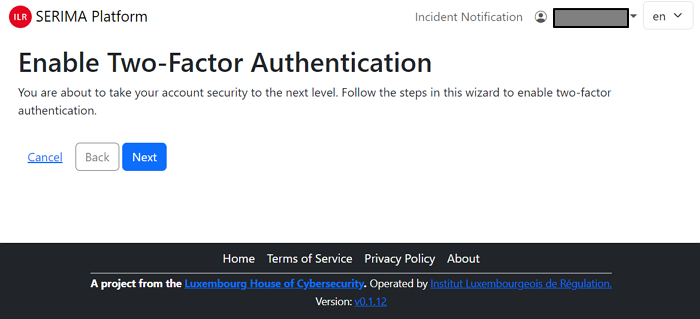
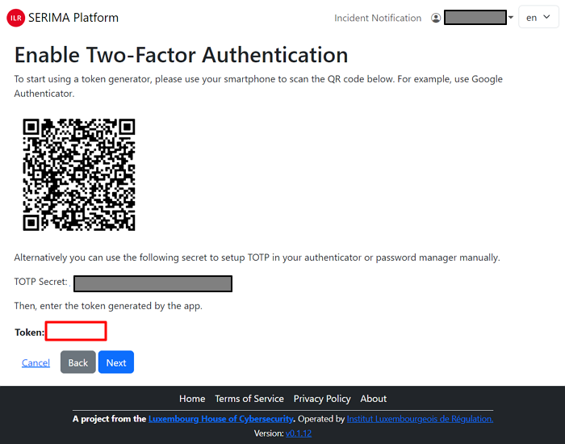
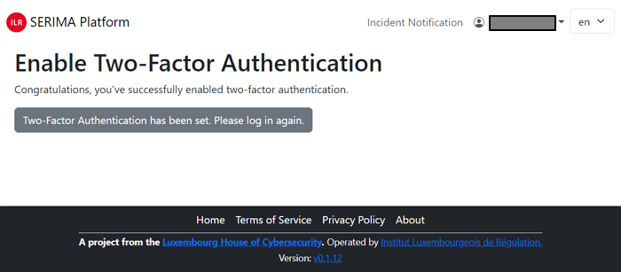
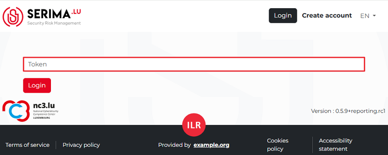
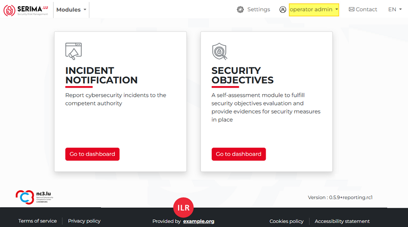

Enable two-factor authentication
----------------------------------

Once you click **Register**, you are logged into the SERIMA Platform. Since this is your first login, 
the system suggests you enable two-factor authentication. Click the button **Enable Two-Factor Authentication**.

Follow the steps in the wizard to enable 2FA: first, click the **Next** button.

Then either use your smartphone and scan the QR code from the screen, or use the long character set called TOTP Secret 
to set up **TOTP** (Time-based One-Time Password) in your authenticator or password manager manually. 
As the last step, please enter the token (a six-digit number) into the Token field and click **Next**.

In case you have successfully enabled two-factor authentication, you are greeted with the following screen:

Please click the grey button and log in again. Provide your email address and password and click **Log in**. 
Then, open your authenticator on your smartphone and type in the randomly generated Token and click **Log in**.

As an **Operator** or **User**, this is your main page where you land whenever you open this application. 
Since this is your first login, there is no incident in the platform to show.

