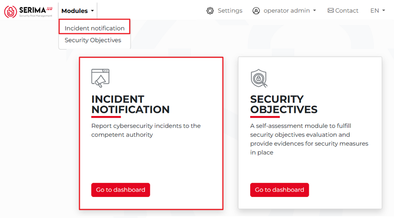
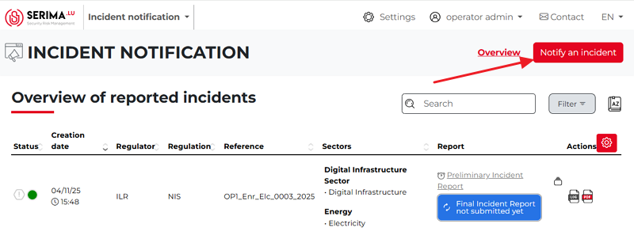
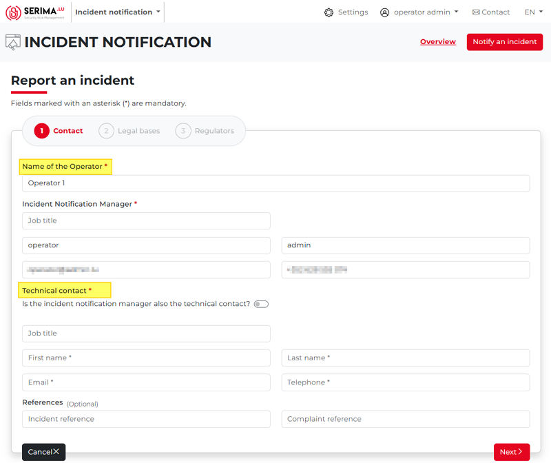
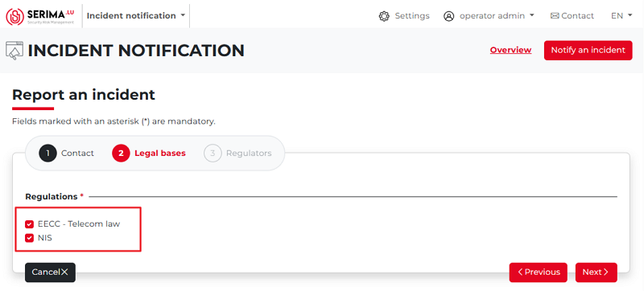
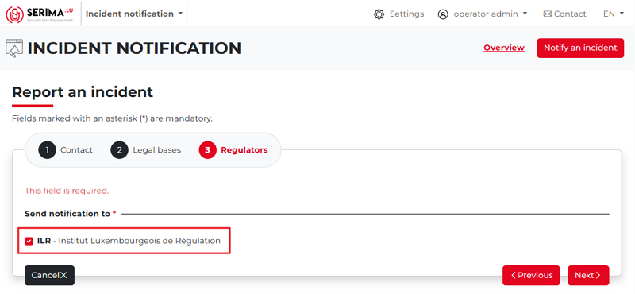
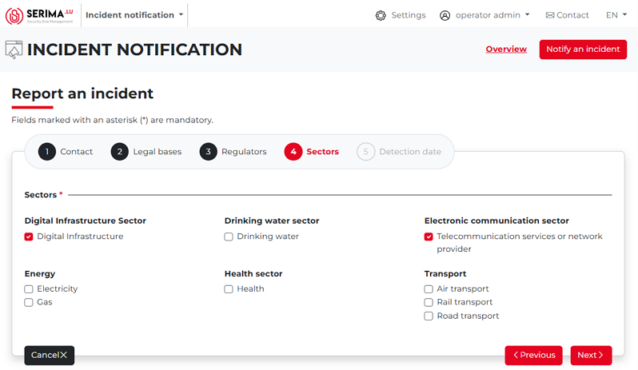
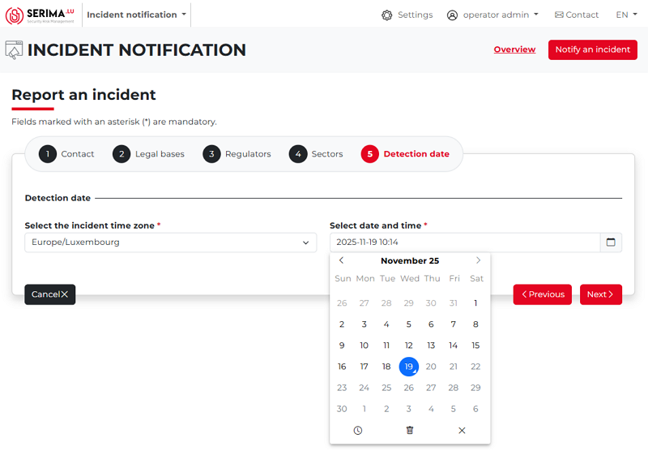
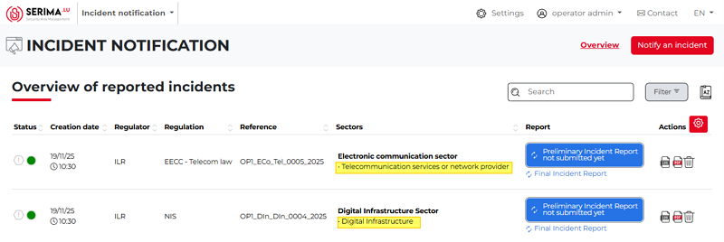

How to report an incident?
---------------------------

To report an incident, you should go to the incident notification dashboard.
You can reach the dashboard by either clicking the **Modules** drop-down menu and selecting **Incident notification**,
or by clicking the Go to Dashboard button of the **Incident notification** tile in the center of the screen.

Either way, you will be taken to the **Incident Notification dashboard**, where you can view an overview of all reported incidents.
Once on the dashboard, click the **Notify an Incident** button in the top-right corner of the screen.

The **Report an Incident** screen appears, showing the three main steps required to submit an incident.
You must complete the **Contact, Legal Bases**, and **Regulators** forms.

Contact form
~~~~~~~~~~~~~~
The **Contact** form appears. Please fill in the required fields, so the authorities to whom you are sending the incident report can get back to you.
The form has three main parts:

1.	**Name of the operator**: This is the person in charge of the incident notification. Provide your name, job title, email, and telephone number.
2.	**Technical contact** (if the same person, please activate the slider, so it will be red)
3.	**References** (Optional): Incident reference, Complaint reference.

Once you have populated all required fields, click **Next**. In case you want to interrupt the process of reporting an incident, click **Cancel**.
If you click Next, you will be directed to the **Legal bases** form.

Legal bases
~~~~~~~~~~~~~~
The next step is the **Legal Bases** form. Select the applicable regulations by checking one or both options (EECC – Telecom Law and/or NIS).
You may choose either regulation individually or both together. After making your selection, click Next to proceed to the **Regulators** form.

Regulators
~~~~~~~~~~~~~~
The next form is **Regulator**. As you can see, there is only one available option: **ILR**.
This field is mandatory and cannot be left blank. After selecting it, click **Next** to continue.

Sectors
~~~~~~~~~~~~~~
On the **Sectors** form, you can indicate which sectors are affected by the incident you are reporting. The main sector options are:

•	Digital Infrastructure sector
•	Drinking water sector
•	Electronic communication sector
•	Energy
•	Health sector
•	Transport

For demonstration purposes, let’s choose two sectors (**Digital Infrastructure**, and **Telecommunication services or network provider**):

Detection date
~~~~~~~~~~~~~~~
As the final step in the incident reporting process, you should provide the timezone and the date and time of the incident.
Entering the date and time of the incident is straightforward. When you click the calendar icon, the field is automatically populated with the current date and time.
From there, only minor adjustments should be needed, as typically there is little difference between the moment the incident is detected and the moment it is reported.

If the detection date field is filled in correctly, click the **Next** button to complete the incident reporting process.
You will then be redirected to the main screen (**Incident List View**), where the newly created incident report will appear.

The table displays the information you entered during the incident report preparation,
along with additional columns such as **Significant Impact, Incident Status**, and **Actions**.

   .. note::

   **Please note that the system creates one incident entry for each sector you select.**

In the previous example, two sectors were chosen (Digital Infrastructure, and Telecommunication services or network provider).
As a result, two separate incidents were created, each represented by its own line in the list.

