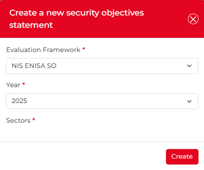
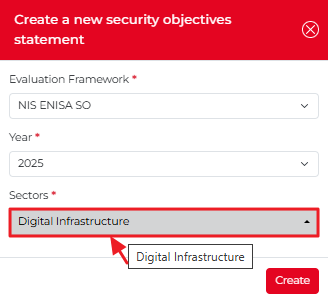
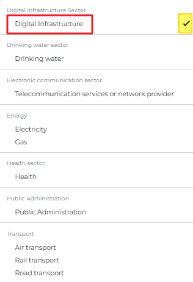
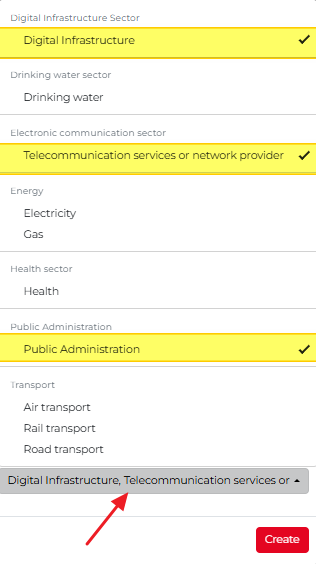
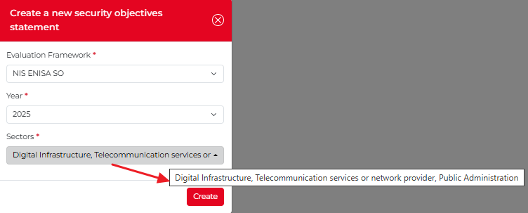

How to submit a security objective?
------------------------------------

To submit a security objective, go to the **Security Objectives Dashboard**.
You can access it either by clicking the **Modules** drop-down menu and selecting **Security Objectives**,
or by clicking the **Go to Dashboard** button on the Security Objectives tile in the center of the screen.

.. figure:: _static/user_manual_images/UM_SER_41.png
   :alt: Security Objectives Module
   :target: _static/user_manual_images/UM_SER_41.png

Either way, you will be taken to the **Security Objectives** dashboard, where you can view an overview of all submitted security objectives.
Once on the dashboard, click the **New submission** button in the top-right corner of the screen.

.. figure:: _static/user_manual_images/UM_SER_57.png
   :alt: New submission
   :target: _static/user_manual_images/UM_SER_57.png

The **Create a new security objectives statement** pop-up appears. Choose the evaluation framework, year, and sector/s from the dropdown menus.

The **Sectors** drop-down menu offers multiple options. Once you have selected an option, it will appear in the dropdown (in the screenshot below, the option **Digital infrastructure** is selected). To select more, click the dropdown again so the options appear, with the checkmark indicating the already selected option.

To select additional options, click the drop-down again; the options will appear, with a checkmark indicating the selected items.

You can select as many options as needed. The selected options appear in the drop-down field and remain visible when you click the Sectors drop-down field again.

When you click the **Sectors drop-down** field again, the original pop-up appears with the selected options in the Sectors drop-down.
If multiple options are selected, not all of them may be visible. Hover your mouse over the Sectors drop-down field to view the selected options.

If all three drop-down menus (Evaluation Framework, Year, and Sectors) contain appropriate values, click the create button.
The **Security Objectives Dashboard** appears, and you can start the process.
In the following chapter, you can read about the workflow for submitting a security objective.
