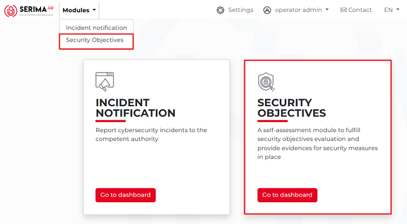
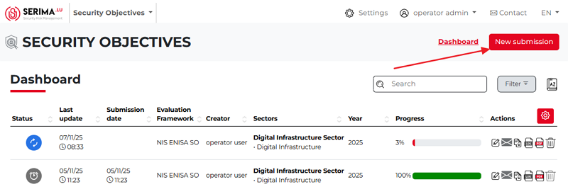

How to submit a security objective?
------------------------------------

To submit a security objective, go to the **Security Objectives Dashboard**. 
You can access it either by clicking the **Modules** drop-down menu and selecting **Security Objectives**, 
or by clicking the **Go to Dashboard** button on the Security Objectives tile in the center of the screen.

Either way, you will be taken to the **Security Objectives** dashboard, where you can view an overview of all submitted security objectives. 
Once on the dashboard, click the **New submission** button in the top-right corner of the screen.

The following pop-up appears. Choose the evaluation framework, year, and sector/s from the dropdown menus.

