Incident notification dashboard
----------------------------------
One of the main functions of this platform is to allow you to report incidents. 
You can begin the process by either clicking the **Modules** drop-down menu and selecting 
**Incident notification** or by clicking the Go to Dashboard button of the **Incident notification** tile in the center of the screen.

.. figure:: _static/user_manual_images/UM_SER_15.png
   :alt: Incident notification module
   :target: _static/user_manual_images/UM_SER_15.png

Either way, you will get to the Incident notification dashboard, where you can see the overview of the reported incidents.
The incident notification dashboard is a central screen where you can manage all your reported incidents. 

Due to the complexity of the screen, its different parts will be presented one by one, with numbered sections describing the functionality of each. 

.. figure:: _static/user_manual_images/UM_SER_1.png
   :alt: Overview of reported incidents
   :target: _static/user_manual_images/UM_SER_16.png

1.	**Overview**: By clicking the **Overview** link in the top-right corner, you can return to the landing page of the Incident Notification dashboard, which displays an overview of the reported incidents.
2.	**Notify an incident**: Click the red **Notify an Incident** button to report an incident. This will take you to the **Report an Incident** page.

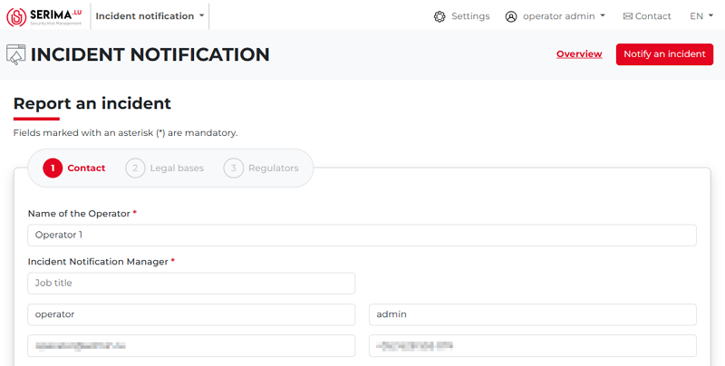

This screen will be described in detail in the “Report an incident” chapter.

3.	**Search**: The search function can be very useful if there are many incidents and you want to filter among them 
according to different aspects to find the incident you are looking for.

4.	**Filter**: You can search among your incidents by Incident ID, status (Closed, or Ongoing), Significant impact 
(Unknown, Yes, or No), and Impacted sectors (a list of available options appears).

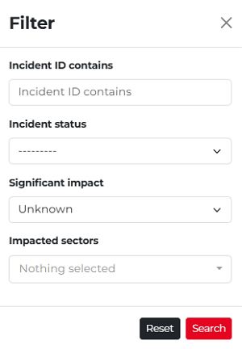

You can filter among all your incidents, and the filter can be used with the following search fields:
    •	**Incident ID contains**: this is a free-word search engine that can be used to search among incident identifiers by character strings.
    •	**Incident status**: The Incident status is a Boolean data type; it can take only two values: “Closed” or “On-going”.

    •	**Significant impact**: This field filters by Significant Impact, which can have two possible values: “Yes” or “No”. 
By default, the value is set to Unknown, meaning that all incidents are shown in the list.
    •	**Impacted sectors**: you can search among the affected sectors here, by clicking on the down-pointing arrow (a list of possible sectors appears, so you can search for a specific sector).

For example, if you click the drop-down menu under **Significant Impact**, select **Yes**, and then click **Search**, 
the incident list will refresh to show only incidents marked as having a significant impact 
(indicated by a white exclamation mark on a red hexagon in the **Status** column). 

Additionally, the **Filter** button will update to show the label **Active** in parentheses. 
In the screenshot below, the mentioned parts are marked with red arrows:

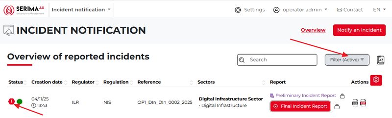

5.	**Icon guide**: The Icon Guide is represented by a book-shaped icon labeled **AZ**. 
Clicking this icon displays the legend above the incident report list (highlighted in yellow in the screenshot below).

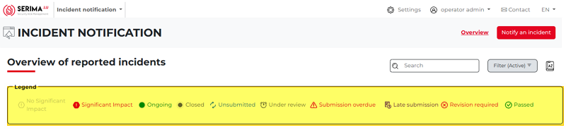

These legends appear in the Status column on the far left of the incident list. 
By looking at the status of the incident, you can have a quick overview of the incident. 
You can hide the legend by clicking the Icon guide again.

6.	**Column headers**: On the dashboard, reported incidents are displayed in a table with the following headers:
**Status, Creation Date, Regulator, Regulation, Reference, Sectors, Report**, and **Actions** (highlighted in yellow in the screenshot below).

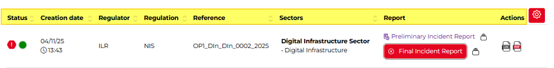

Except for the **Report** and **Actions** columns, each column has an up-and-down arrow on its right edge. 
Clicking the arrow sorts the incidents in ascending or descending order based on that column. 
The active sort is indicated by the arrow appearing bold. 

Only one sorting aspect can be active at a time, and the active aspect is shown by a darker grey triangle. 
As shown in the screenshot below, the two incidents are sorted by **Creation Date** in descending order, with the most recent incident at the top and the earlier one below.

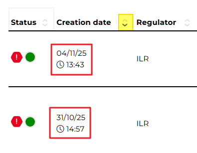

7.	**Column settings**: By default, all columns listed in point six are displayed on the dashboard. To hide a column or change which columns are shown, click the **Column Settings** icon, which is a white gear icon on a red background. Hovering your mouse over the icon displays the tooltip **Column Settings**.

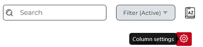

Clicking the icon opens the **Choice of Columns** pop-up, showing all available columns. A checkmark in front of a column name indicates that the column is currently displayed. To hide a column, simply remove the checkmark next to the relevant column name.

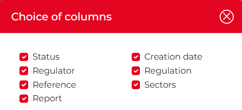

For example, if most incidents you report are related to the same sector, displaying the Sectors column may not be necessary. Hiding it can make the incident list on the dashboard cleaner and easier to understand. Once you uncheck a checkbox, the relevant column immediately disappears from the dashboard. 

In the example below, the **Regulator**, **Regulation**, and **Sectors** columns were hidden (since the values were always ILR as the regulator, NIS as the regulation, and Digital Infrastructure as the sector). As a result, only the columns with varying values remain visible:

8.	**Version control**: For each reported incident, version control shows when changes occurred and what was updated in the relevant report. If you hover your mouse over the **Version control** icon (highlighted in yellow in the screenshot below), a tooltip labeled **Version control** appears. 

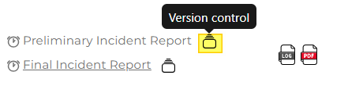

Clicking the icon opens the Version Control pop-up. At the top, you will see the name of the reported incident (taken from the **Reference** column). Below that, you can view the date or dates on which actions occurred, the status to which the report was changed, and two action buttons. These buttons allow you to either review the report or download it as a PDF document.

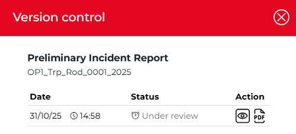

If you click **Review**, you will return to the report itself, where you can make edits. Downloading a report can be useful for several reasons. The most common reason is the ability to share its contents with someone else, including individuals who do not have access to the platform.

9.	**Access log**: For each reported incident, the access log displays all activities that occurred during the incident's lifecycle. If you hover your mouse over the **Log** icon (highlighted in yellow in the screenshot below), a tooltip labeled **Access log** will appear. 

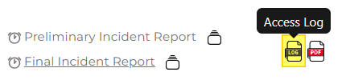

Clicking the icon opens the log. At the top, you can see the name of the report (taken from the **Reference** column), and below it, a table with the columns **Date, User, Role, Document**, and **Action**. You can sort the columns by clicking the up- or down-pointing arrows beside each column header.

In the example below, the **Date** column is sorted chronologically from oldest to newest (indicated by the upward-pointing arrow highlighted in yellow). This allows you to see the earliest record at the top and follow, step by step, on which day which user (and in what role) performed what action on which document.

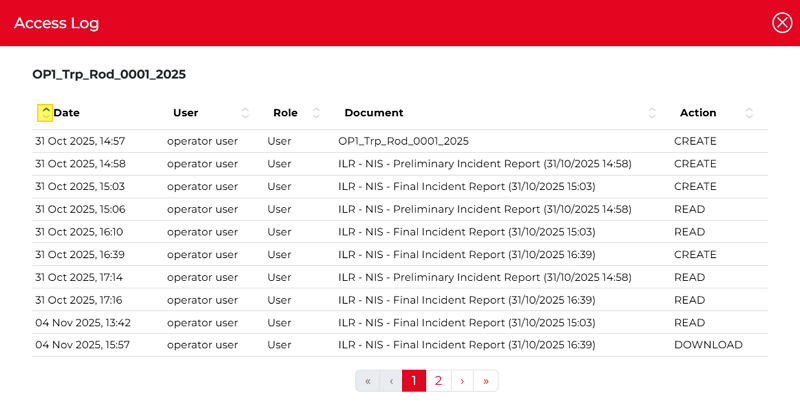

10.	**Download PDF report**: For each reported incident, you have the option to download it as a PDF report. If you hover your mouse over the **PDF** icon (highlighted in yellow in the screenshot below), a tooltip will appear. You can download the report by clicking the **Download PDF report** button.

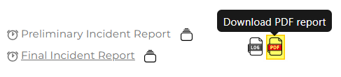

