Incident Reporting Workflow - Operator
----------------------------------------

This chapter explains how the incident reporting workflow functions in the SERIMA system. 
The chapters **How to Report an Incident** and **Reported Incidents View** provide an overview of the SERIMA user interface. 
In this chapter, you will use that information to explore, step by step, how the SERIMA platform manages the incident reporting workflow.

**Basic Incident Reporting Workflow**

The incident reporting process begins when the **Operator Administrator** identifies an incident and submits a report in the system. 
The report is then forwarded to the **Regulator**, who reviews the submitted information for completeness and accuracy. 
If required, the Regulator may request additional details or clarifications from the Operator Administrator. 
Once all necessary information has been provided, the Regulator validates the report and completes the review process.

Operator Admin’s Workflow
~~~~~~~~~~~~~~~~~~~~~~~~~~

1. The **Operator Admin** goes to the Incident Notification dashboard and clicks the button **Notify an incident**.

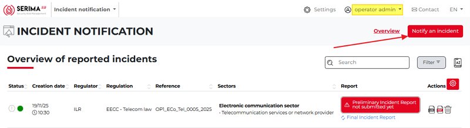

2.	The Operator Admin completes the **Contact, Legal Bases**, and **Regulators** forms, then clicks **Next**.

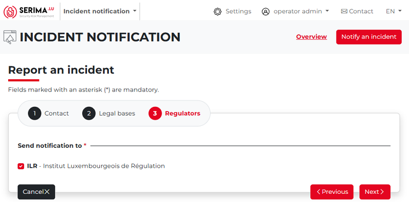

3.	The Operator Admin completes the **Sectors** and **Detection Date** forms, then clicks **Next**.

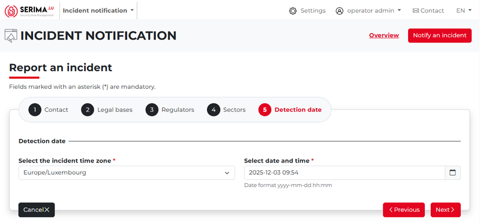

4.	As the next step, the Operator Admin fills out the **Incident Timeline** form, providing information about the incident itself, including the incident timezone, notification date, detection date, start date, and resolution date (the screenshot below has been truncated):

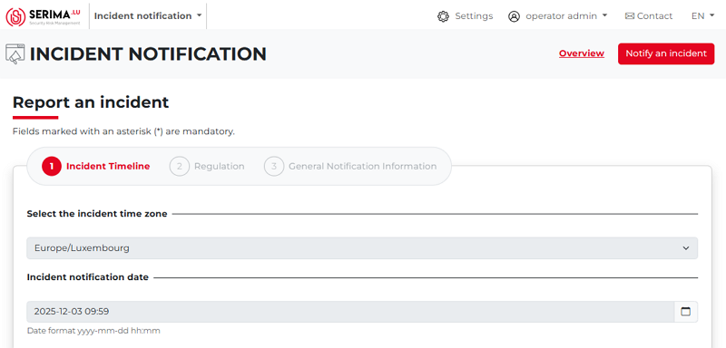

5.	Next, in the **Regulation form**, the Operator Admin selects the affected regulation(s) and NIS services. 
When finished, the Operator Admin clicks **Next** (the screenshot below has been truncated):

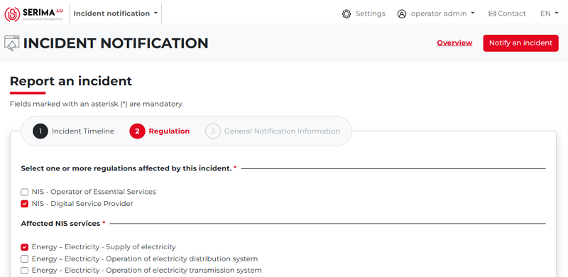

6.	On the **General Notification Information** form, the Operator Admin can provide detailed information about the impact on essential services, the estimated number of people affected, the estimated duration of the incident, the geographical area impacted, and other relevant aspects of the incident. 

The Operator Admin can also indicate whether support is required from GovCERT or CIRCL. (The screenshot below has been truncated.)

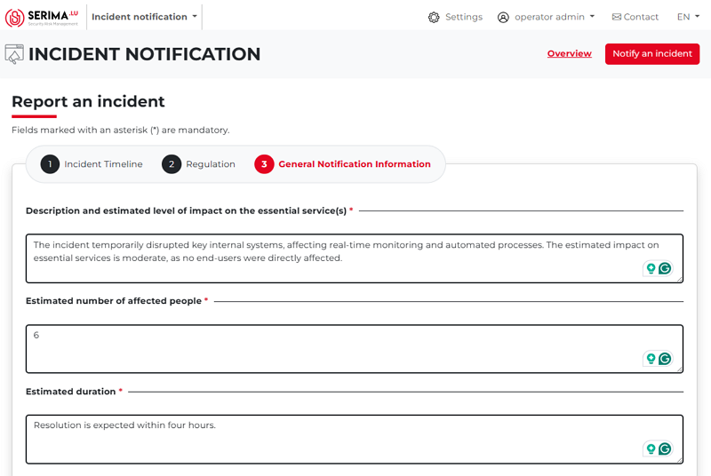

7.	Once the form is completed, the Operator Admin should click **Submit**. The submitted incident report then appears on the **Overview of Reported Incidents** screen. 
    
The reference number (highlighted in green) is important, as it allows the Operator Admin to search for the reported incidents. 
As shown in the screenshot below, the status of the report (under the Report column) is **Preliminary Incident Report**, indicated by a clock icon (highlighted in yellow). Both the status and icon are displayed in grey.

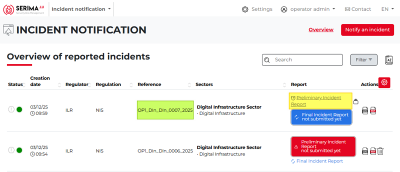

Clicking the **version control** icon in the **Actions** column opens a pop-up showing that the **Preliminary Incident Report** with reference **OP1_DIn_DIn_0007_2025** was created (including time and date), and its status is **Under Review**.

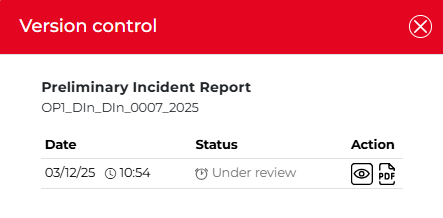

As the next step, the report is sent to the Regulator. 
The Regulator checks and reviews the content of the report and either accepts it or asks for further information.

If the report is accepted by the Regulator Admin
~~~~~~~~~~~~~~~~~~~~~~~~~~~~~~~~~~~~~~~~~~~~~~~~~~~~

If the report is accepted by the Regulator Admin, the **Preliminary Incident Report** is displayed with a green background.

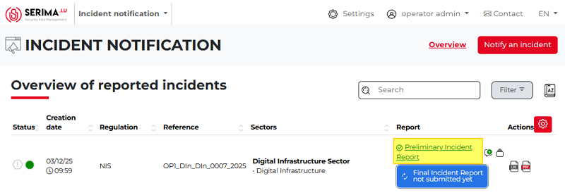

If the Operator Admin hovers the mouse over the report, a pop-up appears indicating that the **report has passed**.

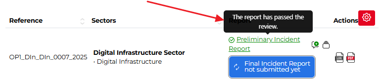

If the Operator Admin wants more information on the report, they should click the **speech bubble icon** with a green plus, 
which indicates that a comment is available. The comment displays the text entered by the Regulator Admin on the **Comment/Explanation** form 
(see the step describing the Regulator Admin’s workflow). 
Clicking the icon opens a pop-up showing the comment of the Regulator Admin.

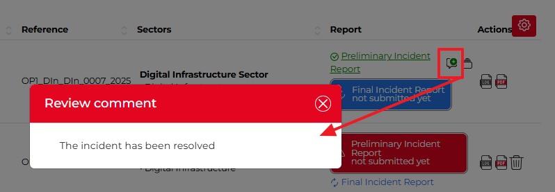

If the report is NOT accepted by the Regulator Admin
~~~~~~~~~~~~~~~~~~~~~~~~~~~~~~~~~~~~~~~~~~~~~~~~~~~~~~

If the report is not accepted by the Regulator Admin, the Preliminary Incident Report is displayed with a red background.

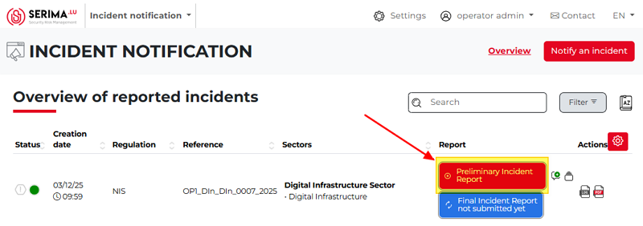

If the Operator Admin hovers the mouse over the report, a pop-up appears indicating that the **report has failed**.

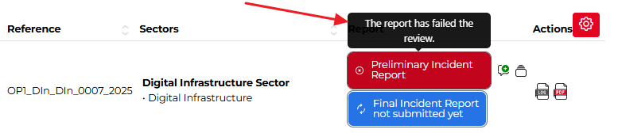

If the Operator Admin wants more information on why the report failed, they should click the speech bubble icon with a green plus, 
which indicates that a comment is available. The comment displays the text entered by the Regulator Admin on the **Comment/Explanation** form 
(see the step describing the Regulator Admin’s workflow). 
Clicking the icon opens a pop-up showing the reason why the report was not accepted.

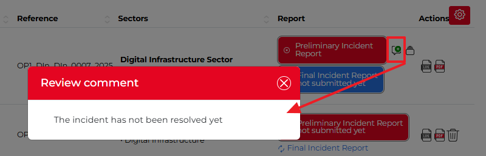
