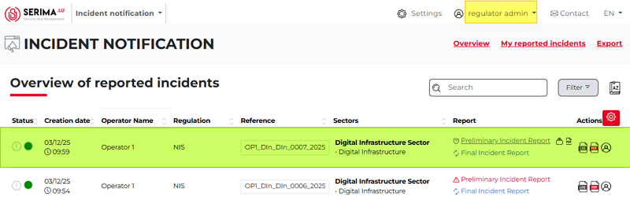
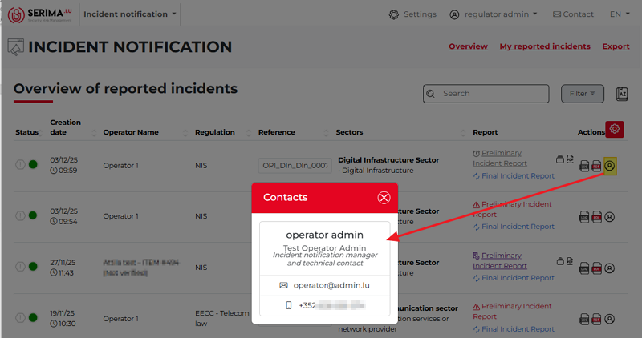
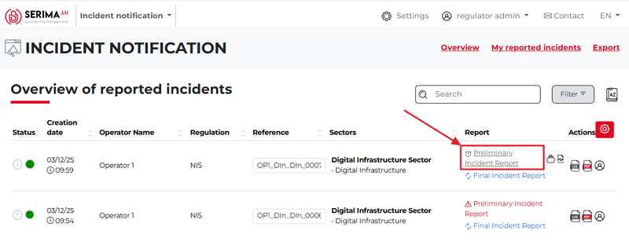
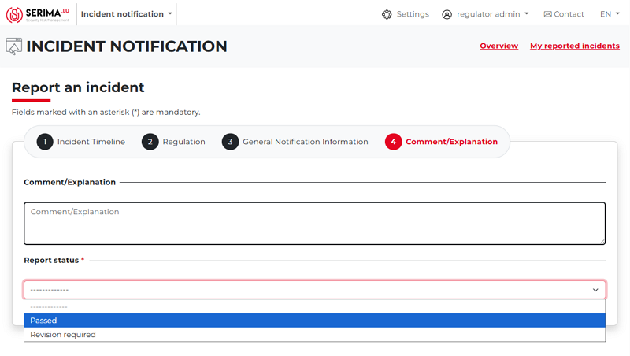
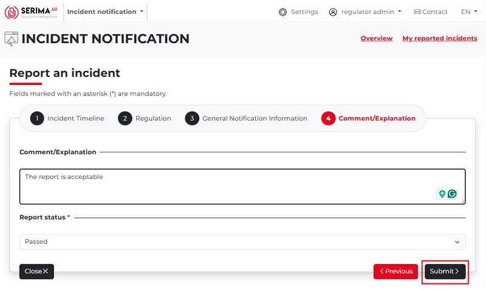
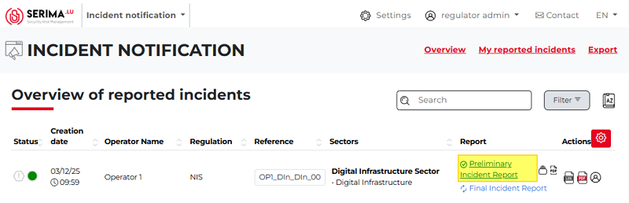
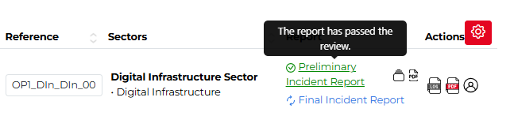
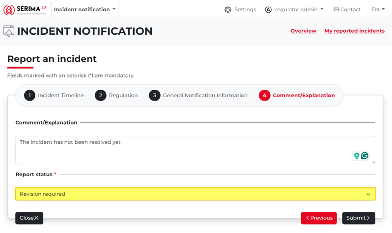
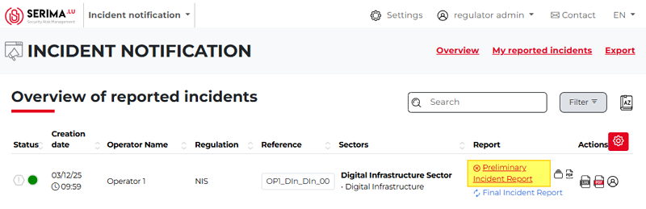
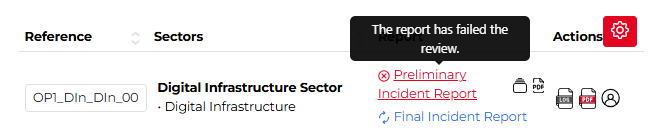

Regulator Admin’s Workflow - Regulator
----------------------------------------

The incident report submitted by the Operator Admin appears on the Regulator Admin’s dashboard (**Overview of Reported Incidents**). 
In the screenshot below, the reported incident is highlighted in green.

The **Regulator Admin** can access all features described in previous chapters, such as version control, access logs, and downloading the report as a PDF.
At this stage, these features are not critical, since the Admin has not yet reviewed the report’s content.

The Regulator Admin can also click the **Contacts** icon on the far right (highlighted in yellow in the screenshot below) to see who submitted the 
incident. If the Admin needs to contact the Operator Admin directly, this feature provides the reporter’s contact details in a pop-up.

**After this explanatory section, the following steps outline how the Regulator Admin reviews the reported incident reports.**

1.	The Regulator Admin clicks the **Preliminary Incident Report** link.

2.	The Regulator Admin reviews the content of the forms (**Incident Timeline, Regulation, General Notification Information**) and adds a comment 
    while setting the report status on the Comment/Explanation form. 

The report status can be set to **Passed** if the Regulator accepts the content, or **Revision Required** if further information or corrections are needed.
In the latter case, the Regulator should provide an explanation of what is missing or needs to be updated for the report to be approved.

3.	Once the status is set, the Regulator Admin clicks **Submit** to save the changes.

If the report is accepted by the Regulator Admin
~~~~~~~~~~~~~~~~~~~~~~~~~~~~~~~~~~~~~~~~~~~~~~~~~~

If the content of the report is acceptable, the Regulator Admin selects **Passed** from the drop-down menu and clicks **Submit**.

After submitting, the platform returns the Regulator Admin to the **Overview of Reported Incidents** dashboard. 
The Preliminary Incident Report is now displayed in green, with a green checkmark icon indicating its updated status.

If the Regulator Admin hovers the mouse over the report, a pop-up appears indicating that the **report has passed the review**.

If the report is NOT accepted by the Regulator Admin
~~~~~~~~~~~~~~~~~~~~~~~~~~~~~~~~~~~~~~~~~~~~~~~~~~~~~~
If the report requires further revision, the Regulator Admin provides an explanation and sets the report status to **Revision Required**.

After submitting, the platform returns the Regulator Admin to the **Overview of Reported Incidents** dashboard. 
The Preliminary Incident Report is now displayed in red, with a red cross icon indicating its updated status.

If the Regulator Admin hovers the mouse over the report, a pop-up appears indicating that the **report has failed the review**.

