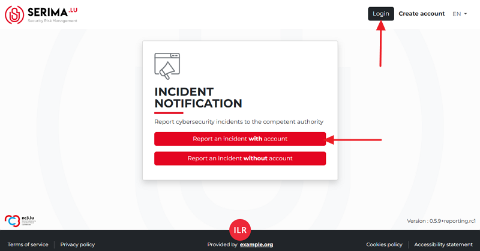
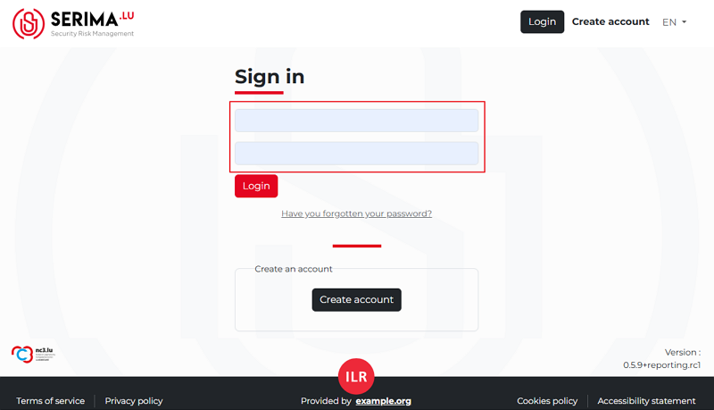
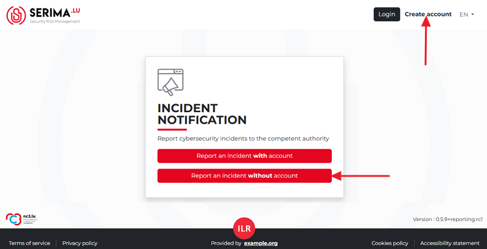

Login page
===========================

If you have an account:
---------------------------
Please log in (by using the Login button in the top right)  or choose the **Report an incident with account** button in the centre of the screen. 

   Screenshot of the login page

Both options will take you to the **Sign in** page. Provide your username and password to log in:

Sign in with your username and password

In case you have forgotten your password or username, please click on the link below the **Login** button that says 
**”Have you forgotten your password?**”.

If you do not have an account:
------------------------------

Please choose the **Report an incident without account** button in the centre or click the **Create account** link in the top right corner:

Report an incident without an account / create an account

Both options will take you to the account creation page.

