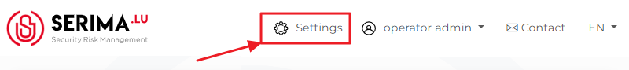
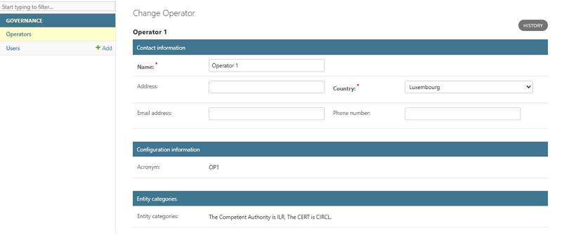
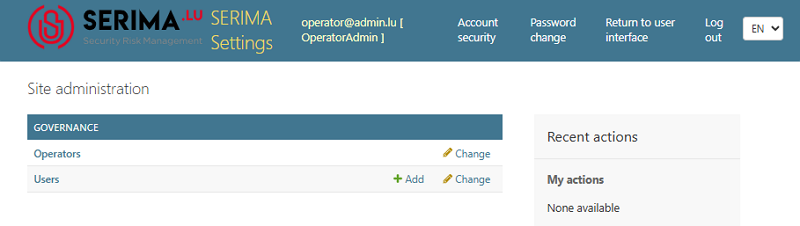
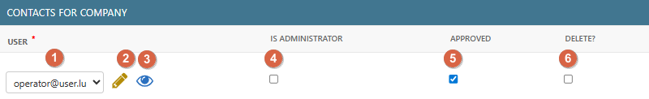

Operator Admin
--------------------

If you are an **Operator Admin**, you can use the **Administration Console** as described below. Please note that the terms Operator and Company are used interchangeably.

To access the Administration Console, once you have logged in as an Operator Admin, click the **Settings** button. 

After clicking **Settings**, you will be directed to the **Administration Console**. As an Operator Admin, you have access only to the **Operators** and **Users** sections in the left panel, called **Governance**:

Operators
~~~~~~~~~~~~~~

If you click the **Operators** link, you will be directed to the **Select the Operator to change** screen. Click the name of the Operator you want to change so you can make changes on the **Change Operator** screen.

At the top, you can view and edit the operator’s **Contact Information** (name, address, country, email address, and phone number). Fields marked with a red asterisk are mandatory. Beneath the **Contact Information** section, you can view (but cannot edit) the **Configuration Information** and the **Entity Categories**.

At the bottom of the screen, you can find the **Contacts for Company** section, which lists all users linked to the selected company. The following section describes the buttons available in the interface and their corresponding functionalities.

1.	**Choose**: You can choose a user by clicking the dropdown menu.

2.	**Edit**: You can edit the user’s contact information (first name, last name, and email address) by clicking the pencil icon.

3.	**View**: The eye (view) icon will take you to the **Change User** screen, where you can also edit or delete the user.

4.	**Is Administrator**: You can create an administrative user (**Operator Admin**) by selecting the **Is administrator** checkbox. If this checkbox is not selected, the user remains an **Operator User** without administrative privileges.

5.	**Approved**: By selecting the Approved checkbox, you can change an **Incident User** into an **Operator User**. 

Incident Users do not belong to any company; they report incidents independently. They are self-registered users who create their own accounts for the purpose of reporting incidents. 

When you select the **Approved** checkbox, you confirm that the user is valid and can be linked to your company. If you approve an Incident User and convert them into an Operator User, the Operator User will be able to view all incidents reported by your company.

6.	**Delete**: The delete checkbox shows that the chosen user has been deleted and is not active in the system.

