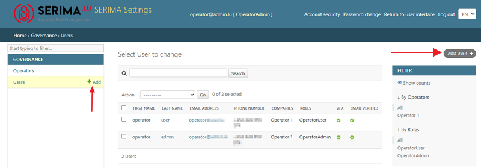
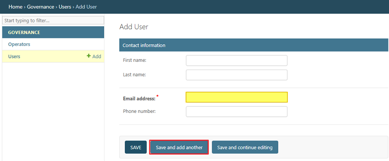
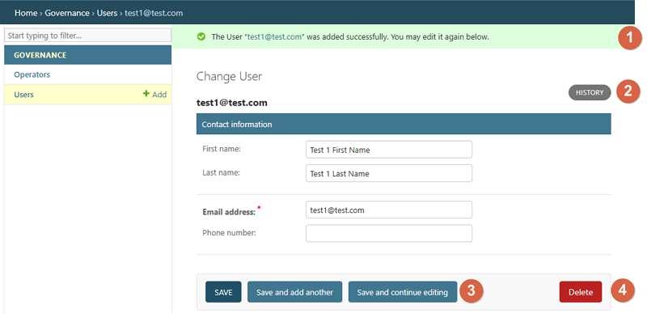
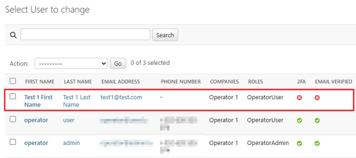
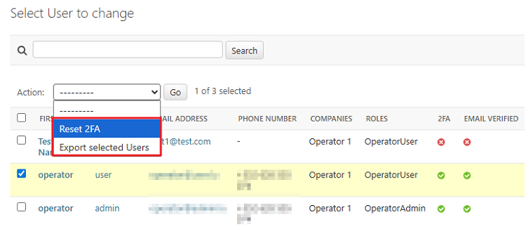
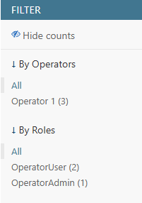

Operator Admin
--------------------

If you are an **Operator Admin**, you can use the **Administration Console** as described below. Please note that the terms Operator and Company are used interchangeably.

To access the Administration Console, once you have logged in as an Operator Admin, click the **Settings** button.

.. figure:: _static/operator_admin_images/OpAdmin_01.png
   :alt: Operator Admin - settings
   :target: _static/operator_admin_images/OpAdmin_01.png

After clicking **Settings**, you will be directed to the **Administration Console**. As an Operator Admin, you have access only to the **Operators** and **Users** sections in the left panel, called **Governance**:

.. figure:: _static/operator_admin_images/OpAdmin_03.png
   :alt: Governance
   :target: _static/operator_admin_images/OpAdmin_03.png

Operators
~~~~~~~~~~~~~~

If you click the **Operators** link, you will be directed to the **Select the Operator to change** screen. Click the name of the Operator you want to change so you can make changes on the **Change Operator** screen.

At the top, you can view and edit the operator’s **Contact Information** (name, address, country, email address, and phone number). Fields marked with a red asterisk are mandatory. Beneath the **Contact Information** section, you can view (but cannot edit) the **Configuration Information** and the **Entity Categories**.

.. figure:: _static/operator_admin_images/OpAdmin_02.png
   :alt: Change Operator
   :target: _static/operator_admin_images/OpAdmin_02.png

At the bottom of the screen, you can find the **Contacts for Company** section, which lists all users linked to the selected company. The following section describes the buttons available in the interface and their corresponding functionalities.

.. figure:: _static/operator_admin_images/OpAdmin_04.png
   :alt: Contacts for Company
   :target: _static/operator_admin_images/OpAdmin_04.png

1.	**Choose**: You can choose a user by clicking the dropdown menu.

2.	**Edit**: You can edit the user’s contact information (first name, last name, and email address) by clicking the pencil icon.

3.	**View**: The eye (view) icon will take you to the **Change User** screen, where you can also edit or delete the user.

4.	**Is Administrator**: You can create an administrative user (**Operator Admin**) by selecting the **Is administrator** checkbox. If this checkbox is not selected, the user remains an **Operator User** without administrative privileges.

5.	**Approved**: By selecting the Approved checkbox, you can change an **Incident User** into an **Operator User**.

Incident Users do not belong to any company; they report incidents independently. They are self-registered users who create their own accounts for the purpose of reporting incidents.

When you select the **Approved** checkbox, you confirm that the user is valid and can be linked to your company. If you approve an Incident User and convert them into an Operator User, the Operator User will be able to view all incidents reported by your company.

6.	**Delete**: The delete checkbox shows that the chosen user has been deleted and is not active in the system.

Users
~~~~~~~~~~~~~~~

To view the number of users on the platform and their types, select the **Users** link in the **Governance** panel on the left. After clicking the **Users** link, you will be directed to the **Select User to Change** screen (also called the **User Table**).

The **Operator Admin** can create new **Operator Users** by clicking the **+Add** link or by using the **Add User** button in the top right-hand corner.

On the **Add User** screen, the Operator Admin can add new Operator Users by filling in the required fields (First name, Last name, Email address, and Phone number). The required field (Email address) is indicated with an asterisk (highlighted in yellow in the screenshot below).
The Operator Admin can create several users by using the **Save and add another** button (circled in red in the screenshot below).

Once you have added a user and clicked **Save**, the user is linked to your company. The **Administration Console** informs you that the user was added successfully (1). If you click the **History button** (2), you can see when and by whom the selected user was added to your company. To edit the selected user, click **Save and continue editing** (3). To delete the user, click **Delete** (4).

Once you have made the changes, you will be directed to the **Select User to Change** page. You can see that the newly added user has not enabled two-factor authentication (2FA) and that the email address is not verified.

How to reset 2FA?
^^^^^^^^^^^^^^^^^^^^^

Choose a user by clicking the checkmark on the far left, before the **First Name** column. Then, go to the down-pointing arrow in the **Action** field and choose the option **Reset 2FA**.

How to export selected users?
^^^^^^^^^^^^^^^^^^^^^^^^^^^^^^^^

Choose a user by clicking the checkmark on the far left, before the First Name column. Then, go to the down-pointing arrow in the **Action** field and choose the option **Export selected users**.

How to filter among users?
^^^^^^^^^^^^^^^^^^^^^^^^^^^^^^^^

Use the **Filter** section on the far right. The **Show counts** link displays how many users and in what roles can be found within your company. In the screenshot below, there are three users in total: two **Operator Users** and one **Operator Admin** (if you choose to filter by roles).
In case you do not want to see the numbers, click the **Hide counts** link.

