Platform Admin
-------------------

If you are a **Platform Admin**, you can use the **Administration Console** as described below. 

  **Please note that as a Platform Admin, you do not have access to the user interface** (when you log in, you are presented with the Admin Console, 
  and you cannot click the Settings button on the user interface). 

There are four sections in the Administration Console: **Administration, Governance, Sites**, and **Recent Actions**.

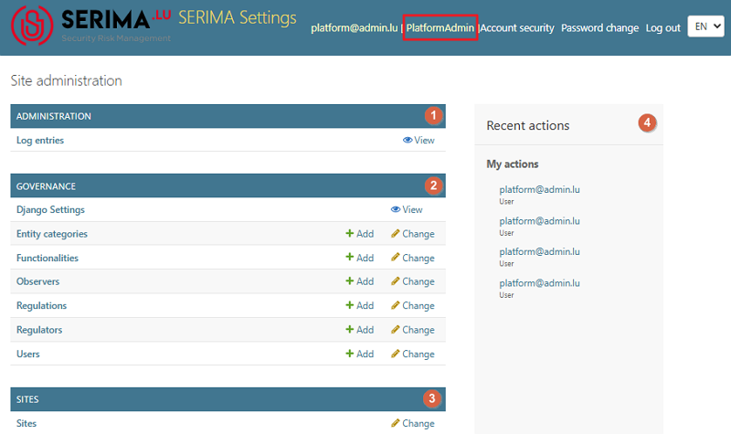

**The Platform Admin has very special rights and scope of activities as follows:**

-	**Creates a common database for all regulators and the users of the regulators**
-	**Configures the server and the regulator users**
-	**Sets up the admin platform**
-	**Creates workflows**

Administration
~~~~~~~~~~~~~~~~~~~~~

In the Administration section, there is only one link called **Log entries**.

Log entries
^^^^^^^^^^^^^^^^^^^^^

A log records any action performed by Regulator Admins or other Platform Admins. When you click the **Log Entries** link (or the **View** link), you are taken to the **Select Log Entry to view** screen. This screen displays a list of all log entries in the system.

The table includes four columns:

-	**Action Time**: 	when the action occurred
-	**User**: 		who performed the action
-	**Content Type**:	which section or type of content was affected
-	**Activity**:		the type of action that was taken

You can sort the columns in descending or ascending order. Also, you can use the search field at the top or use the **Filter** section on the right to narrow down the number of entries and find the log you are looking for.

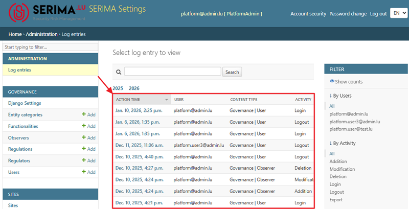

If you need further information about a log entry, click its link in the **Action Time** column. You will be directed to the **View Log Entry** screen, where you can find additional details about the selected log entry.

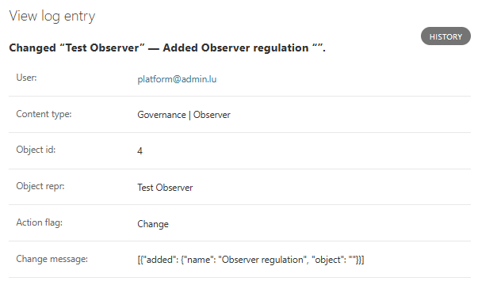

Governance
~~~~~~~~~~~~~~~~~~~~~

The next section in the left panel is called **Governance**. It includes several functionalities, which are briefly explained in this chapter.

Django Settings
^^^^^^^^^^^^^^^^^^^^^

You can use **Django Settings** to check the configuration of your **SERIMA** server instance. The variables you can see here are read-only.

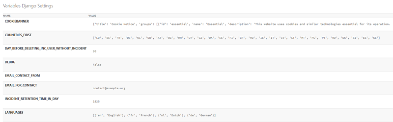

Entity categories
^^^^^^^^^^^^^^^^^^^^^

The Platform Admin creates the categories for the Operators. Entity categories are used to classify operators (depending on the terminology used in different regulations, operators, companies, and entities may be used to refer to the same thing). 

Click the **Entity categories** link in the **Governance** section to go to the **Select entity category to change** screen. Here, you can see a list of categories (if any have been set up). You can create new categories by clicking the **Add Entity Category** button in the top right corner.

To **delete a category**, first select it by checking the box next to the category. Then, open the **Action** drop-down menu and choose the **Delete selected entity categories** option, and click Go.

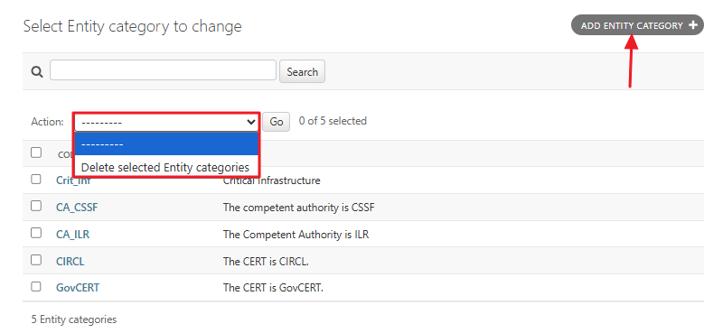

There are two columns on the **Change Entity category** screen. The **Code** column on the left displays the code you assigned to the entity when you set it up. The **Label** column indicates the type of classification you want to create for different entities in the **SERIMA** system. This is also defined when you create a new entity category or modify an existing one.

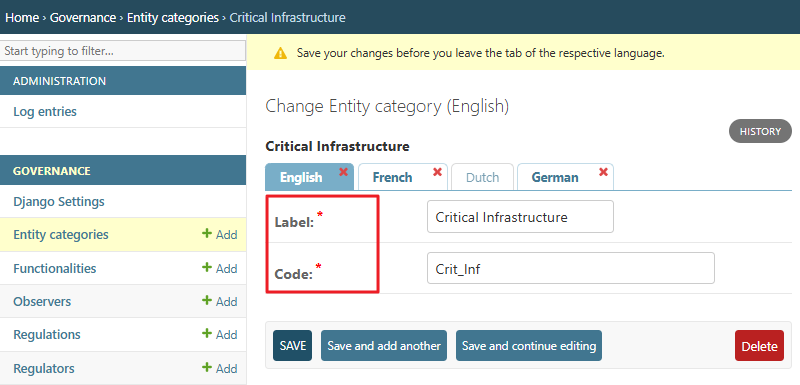

Functionalities
^^^^^^^^^^^^^^^^^^^^^

The **Functionalities** section shows which modules are enabled in the platform. As per the screenshot below, there are two modules set up in the system: **Reporting** and **Security Objective**.

To **create a new Functionality**, click the **Add Functionality** button in the top right corner. To **delete a Functionality**, first select it by checking the box next to the functionality. Then, open the Action drop-down menu and choose the **Delete selected Functionalities** option, and click **Go**.

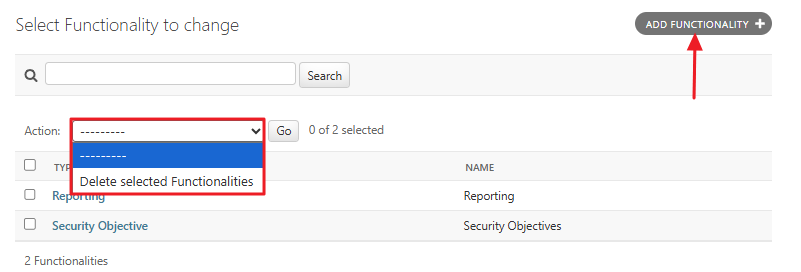

Observers
^^^^^^^^^^^^^^^^^^^^^

**An observer is a type of regulator with limited permissions. Observers cannot edit incidents on the platform; they have read-only access and can only view incidents.**

As a Platform Admin, you can create an Observer either by clicking the **Add Observer** button in the top-right corner or by selecting the **Add** link in the Governance section. The **Change Observer** screen appears, where you can set up a new Observer.

When creating a new Observer, provide its name, description, country, and address. Then configure its functionalities by selecting and adding them to the **Chosen Functionalities** list:

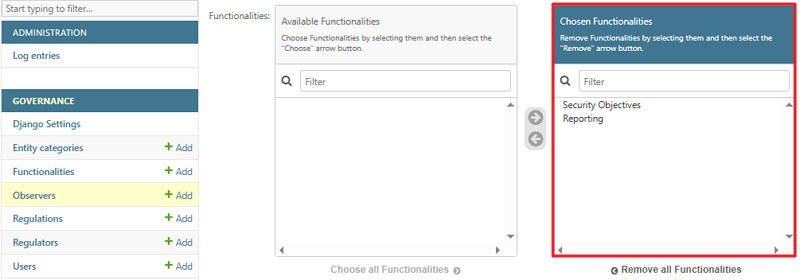

Finally, add observer users and observer regulations (legal basis) to the Observer. Use the down-pointing arrows to open the dropdown menus and select a different user or regulation. 

If you cannot find the item you are looking for, use the **Add another Observer user** and **Add another Observer regulation** links to create new entries.

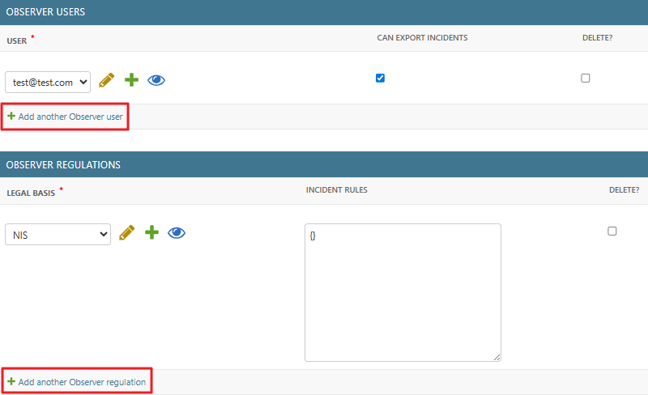

To **delete an Observer**, first select it by checking the box next to the observer entry. Then, open the **Action** drop-down menu and choose the **Delete selected Observers** option, and click **Go**.

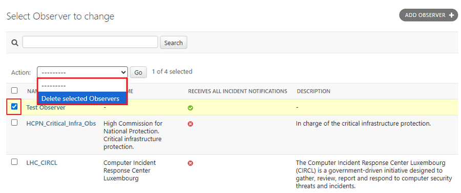

Regulations
^^^^^^^^^^^^^^^^^^^^^

**SERIMA** is a multi-regulation platform, allowing you to create different workflows for different regulations.

**As a Platform Admin, you can set up new regulations** either by clicking the **Add Regulation** button in the top-right corner or by selecting the **Add** link in the Governance section. Either way, you will be directed to the **Add Regulation** screen, where you can assign a label for the regulation and add regulators to it:

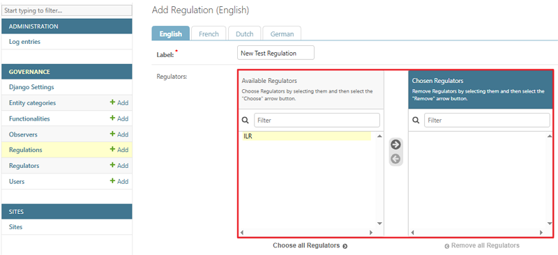

When creating a regulation, you need to add a **Label** for it (labels are displayed in the first column, as shown in the screenshot below). Then, you need to assign a regulator from the list and save your changes.

To **delete a regulation**, first select it by checking the box next to the regulation entry. Then, open the **Action** drop-down menu and choose the **Delete selected Regulations** option, and click **Go**.

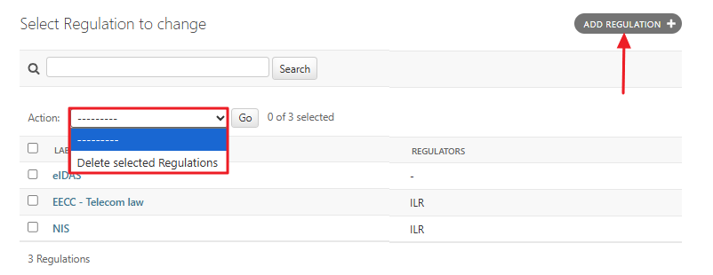

Regulators
^^^^^^^^^^^^^^^^^^^^^

By following the **Regulators** link in the **Governance** section, you can check the list of Regulators set up in the system.

**As a Platform Admin, you can set up new regulators** either by clicking the **Add Regulator** button in the top-right corner or by selecting the **Add** link in the Governance section. 

The **Add Regulator** screen appears, where **you can set up a new Regulator**. When creating a new Regulator, provide its name, description, country, address, and email address (for incident notification). 

Then **configure the regulator’s functionalities** by selecting and adding them to the **Chosen Functionalities** list:

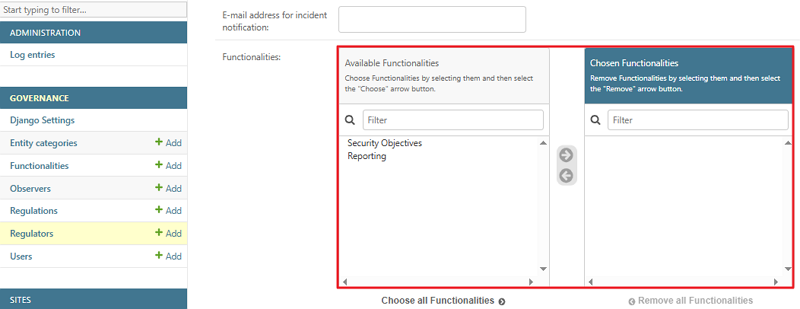

Delete a regulator user
^^^^^^^^^^^^^^^^^^^^^^^^^^^^^^

To delete a regulator user, go to the **Regulator Users** section of the chosen regulator and do the following:

1. Choose a user you want to delete,
2. Select the checkbox in the Delete column, 
3. Click Save.

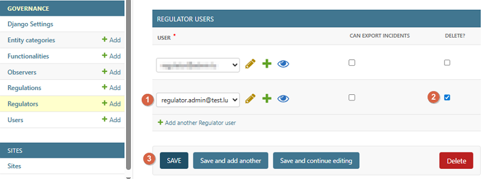

**NOTE: Do NOT use the red Delete button in the lower right-hand corner! It deletes the Regulator itself.**

Delete a Regulator
^^^^^^^^^^^^^^^^^^^^^^^^^^^^^^

You have two options to delete a regulator:

1.	Select the Regulator by checking the checkbox next to the regulator entry. Then, open the **Action** drop-down menu and choose the **Delete selected Regulators** option, and click **Go**.

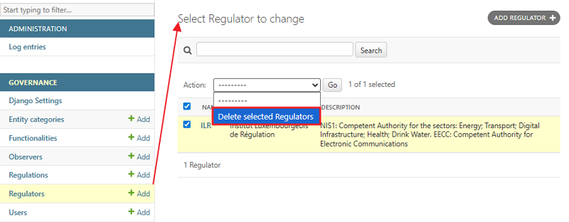
 
2.	Click the name of the regulator on the **Select Regulator** to change the screen to open the **Change Regulator** screen. Once on the Change Regulator screen, click the red **Delete** button in the lower right-hand corner. If you have the necessary permission level, the chosen regulator will be deleted from the system.

Users
^^^^^^^^^^^^^^^^^^^^^^^^^^^^^^

**Platform Admins can create other Platform Admins, Regulator Admins, and Observer Users**. If you click the Users link in the **Governance** section, you will be directed to the **Select User to Change** screen. This screen lists all users (Platform Admins, Regulator Admins, and Observer Users) that the Regulator Admin of your **SERIMA** instance has set up.

You can add new users by clicking the **Add** link in the **Governance** section or by using the **Add User** link in the top right-hand corner. The Add User screen appears, where you can provide basic information such as First Name, Last Name, Email Address, and Phone Number.

After creating a user, remember to add them to one of the entities (Regulators or Observers). To do this, open the Regulator or Observer where you want to link the user. For example, to add a user to an Observer, click the Observer’s name, and on the **Change Observer** screen, use the **Add another Observer user** option to link the user to the selected Observer.

To create Observer users, use the **Observers** link. To create Regulator users, use the **Regulators** link in the **Governance** section.

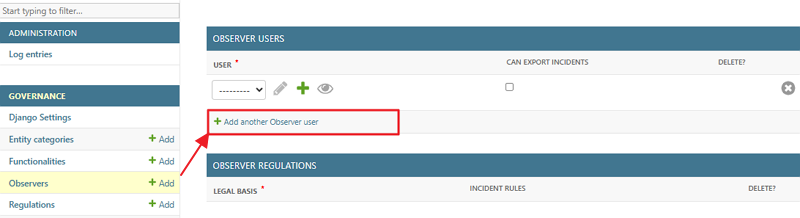

In case you have many users in your **SERIMA** instance, use the **Filter** on the right. You can filter users by regulators, observers, or roles. By default, all options are displayed. To narrow the list, click the specific link you are looking for. For example, under **By Roles**, clicking **Regulator Admin** will display only the Regulator Admins in your system.

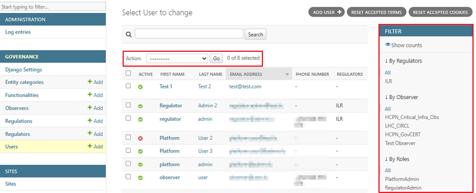

Besides filtering, you can sort users by clicking the heading of the column you want to sort, either in ascending or descending order. To manage users, first select the checkbox in front of the user you want to modify, then choose the desired action from the **Actions** dropdown menu.

The screenshot below shows that three out of eight users have been selected. By choosing an action from the **Action** dropdown and clicking the **Go** button, the selected action is performed: for example, resetting 2FA or exporting the three selected users.

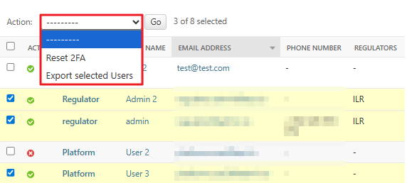

Export selected Users
^^^^^^^^^^^^^^^^^^^^^^^^^^^^^^

Select the users you want to export by checking the box next to each relevant user. Then, open the **Action** dropdown menu, choose **Export Selected Users**, and click **Go**. The selected users will be exported to a CSV file.

Sites
~~~~~~~~~~~~~~~~~~~~~

This feature is for the **platform configuration**. This is where you can **set up the URL of your SERIMA instance**. You may right-click on the site URL to open it on a new tab, where you can **edit the Domain name and Display name of your platform**.

