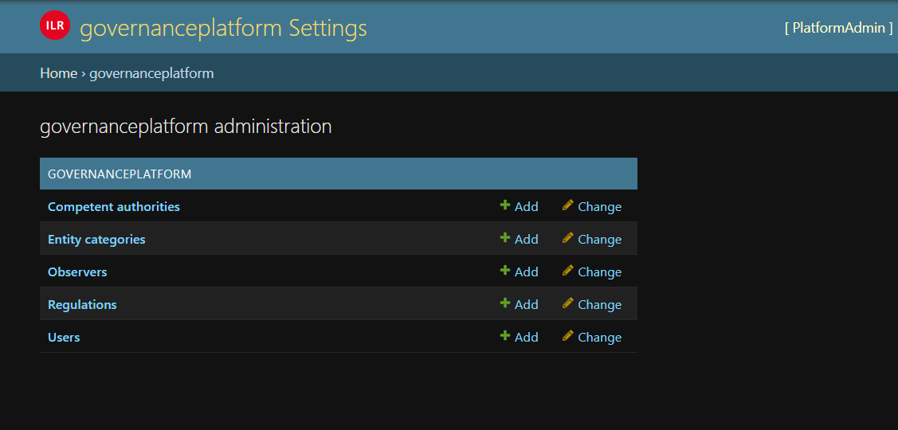
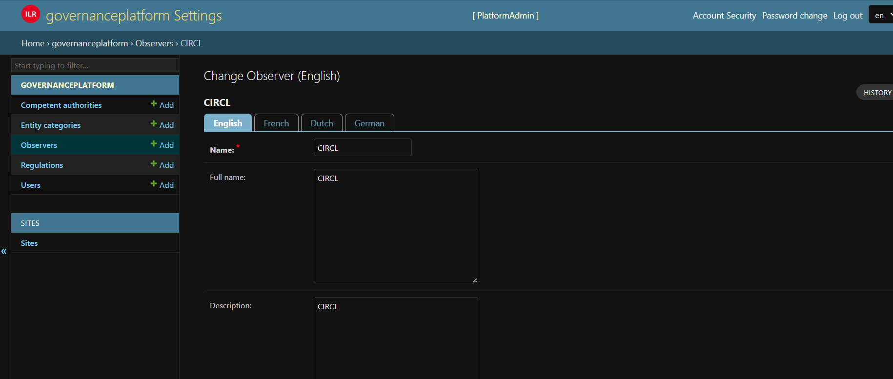
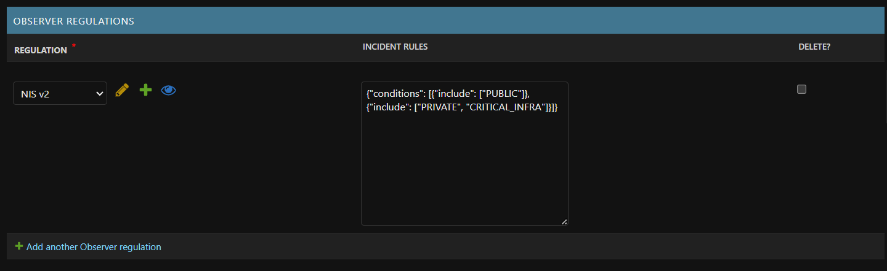

Platform Administrator interface
=====================================

log-in
-------

On this page you can log in or create an account in case you have to notify an incident and you don't have credentials.

.. figure:: _static/ui_user_login_page.png
   :alt: Login page.
   :target: _static/ui_user_login_page.png

   Screenshot of the login page.

If you have credentials and don't remember the password please use the link: 'Forgotten your password or username?'

At the first login, you need to activate the 2FA.

Standard functionnality 
-----------------------------------

   Main page.

To see the standard function, have a look to the Administrator interface. 

Definition of observers 
-----------------------------------

To define the rules of incident reception for observer, you need firt to create ``Entity categories`` (e.g. Private, Public, Critical infrastructure, etc.).

   Definition of an observer.

- The checkbox ``Receives all incidents``, if it's checked the observer will receive all incidents, **no matter of the regulation**. If you need specific rules you have to define ``observer regulations``

   Observer regulation.

For observer regulation you need to define: 

1. The regulation concerned by the rules
2. The incident rules. The incident rules has to be defined as a JSON format following this structure:

.. code-block:: 

    {
        "conditions":[
            {
                "include":[
                    "PUBLIC"
                ]
            },
            {
                "include":[
                    "PRIVATE",
                    "CRITICAL_INFRA"
                ]
            }
        ]
    }

In the case above the regulation receive the incident which are ``PUBLIC`` **OR** the incidents which are ``PRIVATE`` and ``CRITICAL_INFRA`` (e.g. NIS2 AND (PUBLIC OR(PRIVATE AND NOT CRITICAL_INFRA))). 
PRIVATE, CRITICAL_INFRA and PUBLIC are ``code`` from ``Entity Category``.

If the observer should receive all incidents of a regulation the ``incident rules`` should be {}. 

.. figure:: _static/ui_observer_regulation_CER.png
   :alt: Observer regulation.
   :target: _static/ui_observer_regulation_CER.png

   Observer regulation.

If incidents should be excluded, the tag exclude can be used in the JSON 

.. code-block:: 

    {
        "conditions":[
            {
                "include":[
                    "PRIVATE"
                ],
                "exclude":[
                    "CRITICAL_INFRA"
                ]
            }
        ]
    }

In the case above if we link to the regulation NIS2 we receive the incident from PRIVATE only and PRIVATE which are not CRITICAL_INFRA (e.g. NIS2 AND PRIVATE AND NOT CRITICAL_INFRA). 
