Regulator Admin
-------------------------
  
In Luxembourg, the regulator is **ILR**. `ILR <https://www.ilr.lu/>`_ can have two types of roles: **Regulator Admin** and **Regulator User**.

The **Regulator Admin** role has permission to create workflows (covering all NIS/EECC-related questionnaires) for users who are required to complete these reports, such as preliminary reports, notifications, and final assessments.

In the user interface, click the **Settings** link to go to the **Site Administration** screen (the Administration Console). 
To return to the user interface, click the **Return to user interface** link in the upper right-hand corner (circled in red in the screenshot below).

.. figure:: _static/regulator_admin_images/Reg_Admin_01.png
   :alt: Regulator Admin - Site administration
   :target: _static/regulator_admin_images/OpAdmin_01.png

The **Site Administration screen** (the Administration Interface) offers the most extensive set of features compared with the **Operator Admin**, 
**Regulator User**, and **Platform Admin** user types.

The Site administration screen has the following parts: Administration, Governance, Incident Notification, Reporting, Security Objectives, and Recent Actions. In the rest of this chapter, each feature will be discussed in detail.

.. figure:: _static/regulator_admin_images/Reg_Admin_02.png
   :alt: Regulator Admin - Site administration
   :target: _static/regulator_admin_images/Reg_Admin_02.png

Administration
~~~~~~~~~~~~~~~~~~~

In the Administration section, you can check the **Log entries** and the **Script execution logs**. 

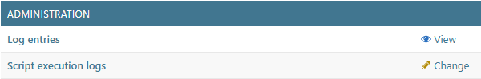

Log entries
^^^^^^^^^^^^^^^^^^^^^^^^

Click either the **Log Entries** or **View links** to go to the **Select log entry view** screen. On this screen, you can check and filter what activity was performed, when the change occurred, which user made it, and what content type was updated. Use the **Search** field or the **Filter** section to narrow down the list.

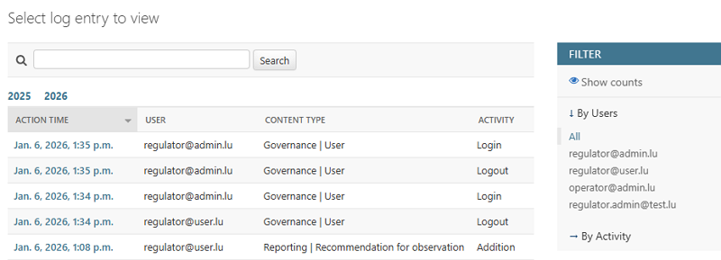

By default, the list items are sorted by **Action Time** in descending order, with the most recent entry at the top and the oldest at the bottom. In this default view, there are no up or down arrows on the right side of the columns.

To sort the list items, first, select the column you want to sort and choose the **sorting order** (ascending or descending). To refine the sorting further, you can select additional columns and specify their sorting order. 

When more than one column is used for sorting, numbers appear next to the up or down arrows to indicate the **sorting sequence**. In the example below, the list of entries is sorted first by **Action Time** (descending), then by **User** (ascending), and finally by **Content Type** (descending).

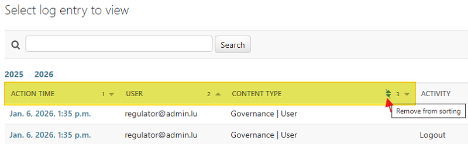

To remove a column from sorting, hover your mouse over the number until an up-and-down triangle appears (see screenshot above). A tooltip saying **Remove from sorting** will be displayed. Click the up-and-down triangle, and the selected column will no longer be used for sorting.

Script execution logs
^^^^^^^^^^^^^^^^^^^^^^^^

The **script execution logs** screen shows the logs from your SERIMA server. The screen shows the log entries in a table format with the columns **Timestamp, Action, Object Representation**, and **Additional information**.

Click the header of any column to sort the entries by that column. An upward-facing triangle in the top-right corner of the column indicates that the entries are sorted in descending order, with older entries at the top and newer ones at the bottom.

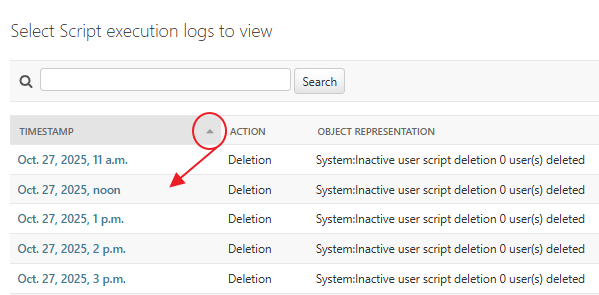

Clicking the triangle again reverses the sorting order. When you hover the cursor over the triangle, a pop-up labeled **Toggle Sorting** appears. A downward-facing triangle then indicates that the newest entries are at the top, and older entries are below.

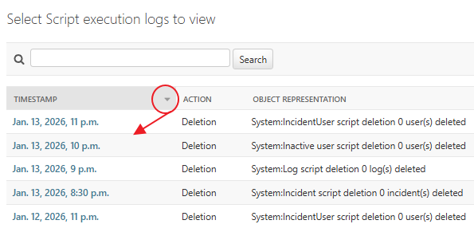

You can sort items by multiple columns. The column headers indicate the sort order, showing which column is first, second, or third in the sequence (and whether the sorting is in ascending or descending order).

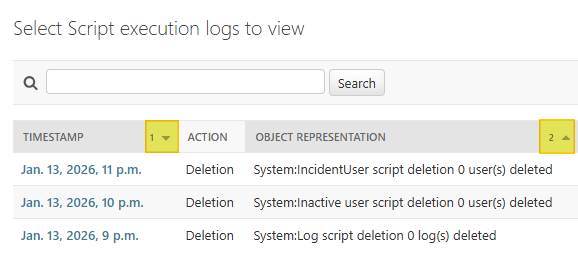

The **Object Representation** column shows what activity the script performed. In most cases, this involves deletions: typically of inactive users, users who registered but were not assigned to any company, or users who did not confirm their registration.

Governance
~~~~~~~~~~~~~~~~~~~

In the Governance section, you can find the following functionalities:

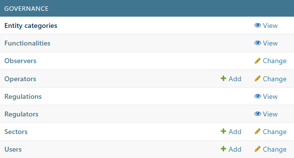

On the left panel, you can see the functionalities and their links. To the right, you can see whether the Regulator Admin has write access (**Add/Change**) or only read access (**View**) for each functionality. **These permissions are set by the Platform Admin.**

Entity categories
^^^^^^^^^^^^^^^^^^^^^^^^

Click the **Entity categories** link to go to the **Select entity category view** screen. On this screen, you can see what kind of entities are defined in your system. You can view an entity on the **View Entity category** screen by clicking on its link. You can set up an entity in four different languages.

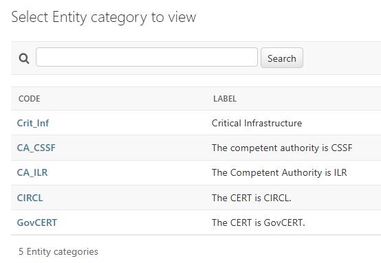

You only have read-only access to the Entity categories. Once you click the name of the Entity Category in the **Code** column, you will be directed to the **View Entity Category** screen:

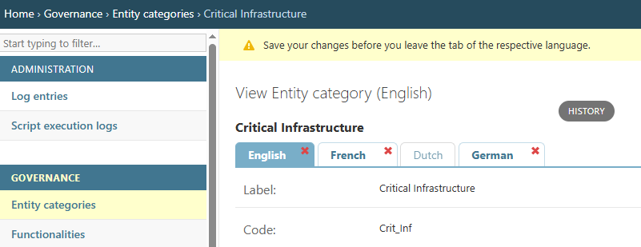

Functionalities
^^^^^^^^^^^^^^^^^^^^^^^^

Click the **Functionalities** link to go to the **Select Functionality to view** screen. On this screen, you can check what kind of functionalities are defined in your system. The screenshot below shows two configured functionalities (Reporting and Security Objective):

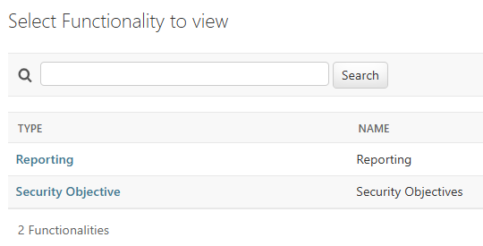

You only have read-only access to the **Functionalities**. Once you click the name of the Functionality in the **Type** column, you will be directed to the **View Functionality** screen:

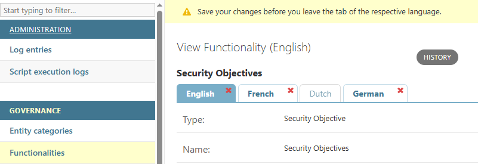

Observers
^^^^^^^^^^^^^^^^^^^^^^^^

Click the **Observers** link to go to the **Select Observers to change** screen. On this screen, you can see what kind of Observers are defined in your system. You only have view access to the Observers screen.

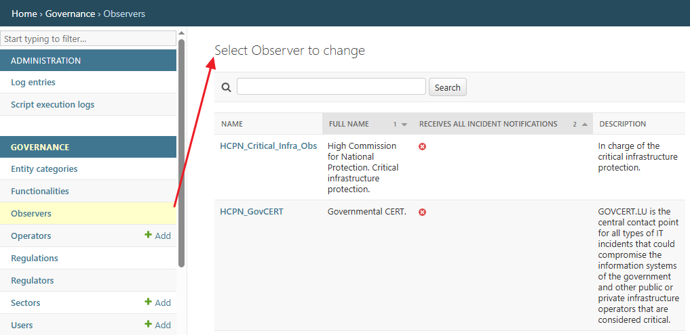

Click the name of the Observer in the **Name** column to view it. Once you click the name of an Observer, you will be directed to the **View Observer** screen. At the top, you can see the contact information of the chosen Observer, whereas further down, you can see the linked Observer Users and Observer Regulations.

Operators
^^^^^^^^^^^^^^^^^^^^^^^^

Click the **Operators** link to go to the **Select Operator to change** screen. On this screen, you can check what kind of operators are defined in your system. The screenshot below shows two configured operators:

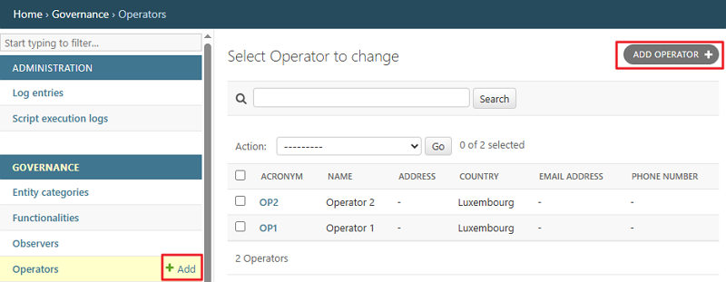

Please note that you can add new operators either by clicking the **Add** link in the **Governance** section on the left panel or by clicking the **Add Operator** button in the top right-hand corner. 

Once clicked, you will be directed to the Add Operator screen, where you can set up a new operator. First, provide the operator’s contact information (name, address, country, email address, and phone number). Then choose an acronym for the operator. Finally, assign entity categories to the operator.

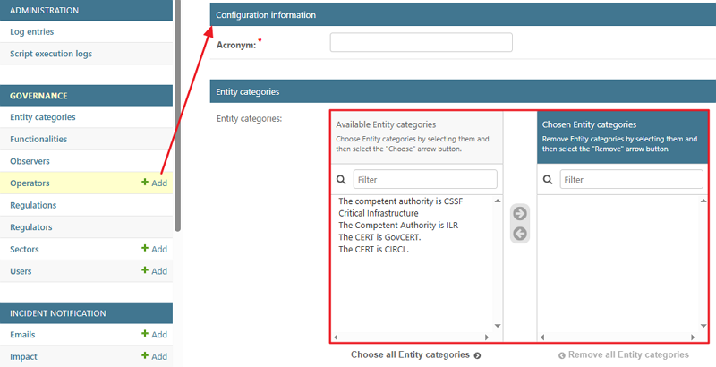

Regulations
^^^^^^^^^^^^^^^^^^^^^^^^

By clicking the **Regulations** link, you can view the regulations that have been set up in your SERIMA instance. **SERIMA is a multi-regulation platform**, meaning that the Platform Admin can configure as many regulations as needed. 

Please note that, as a **Regulator Admin**, you do not have write permissions for this functionality and, therefore, cannot add or delete regulations. You can only view the regulations available in your system.

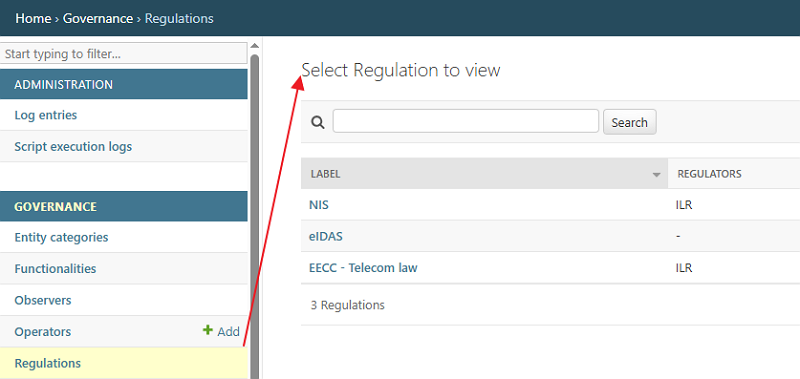

Once you click the name of a regulation, you will be directed to the **View Regulation** screen, where you can see the regulation **Label** and the **Regulators** linked to it.

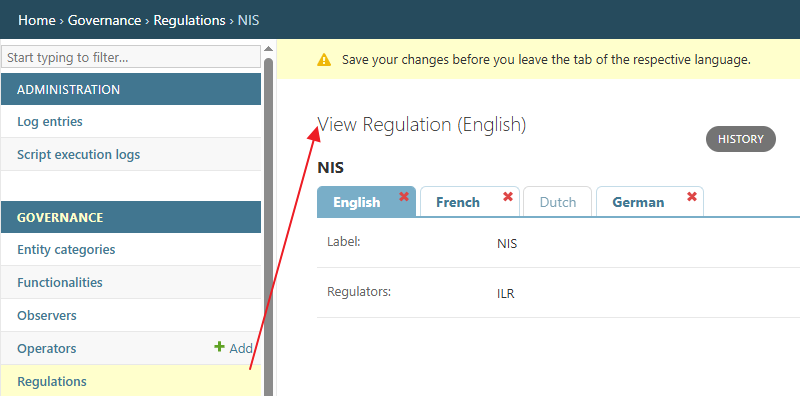

Regulators
^^^^^^^^^^^^^^^^^^^^^^^^

By clicking the **Regulators** link, you can view the regulators that have been set up in your SERIMA instance. 

  **Please note that, as a Regulator Admin, you do not have write permissions for this functionality and therefore cannot add or delete regulators.**      You can only view the regulators available in your system (set up the Platform Admin).

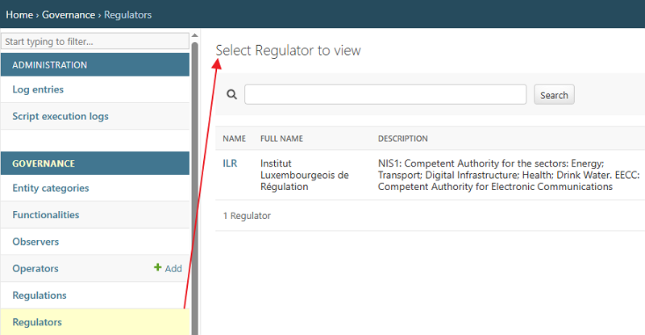

Once you click the name of a regulator, you will be directed to the **Change Regulator** screen, where you can view detailed information about the selected regulator. At the top of the screen, the regulator’s contact details are displayed (name, address, country, email address, and phone number). Below this, you can see the linked regulator users and their associated sectors.

Sectors
^^^^^^^^^^^^^^^^^^^^^^^^

By clicking the **Sectors** link, you can go to the **Select Sector to Change** screen. There are three columns (**Acronym, Name, Parent Sector**) displayed. To sort the list items, first select the column you want to sort and choose the sorting order (ascending or descending). To refine the sorting further, you can select additional columns and specify their sorting order. 

An upward-facing triangle in the top-right corner of the column indicates that the entries are sorted in descending order, with older entries at the top and newer ones at the bottom.

When more than one column is used for sorting, numbers appear next to the up or down arrows to indicate the sorting sequence. In the example below, the list of entries is sorted first by **Acronym** (descending), then by **Parent Sector** (ascending).

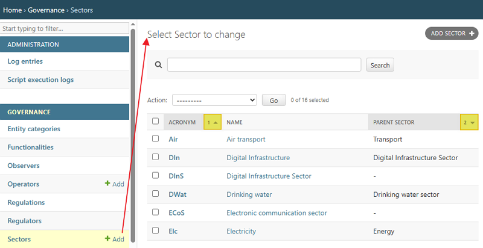

Please note that you can add new sectors either by clicking the **Add** link in the Governance section on the left panel or by clicking the **Add Sector** button in the top right-hand corner. Either way, you will be directed to the **Add Sector** screen, where you can create a new sector by providing its name, parent sector (optional), and acronym.

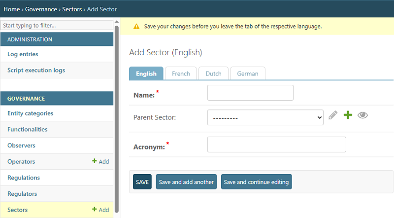

Once you set up a new sector and click Save, the newly-added sector appears on the list of Sectors.

Users
^^^^^^^^^^^^^^^^^^^^^^^^

To view the users and their types, select the **Users** link in the **Governance** panel on the left. After clicking the Users link, you will be directed to the **Select User to Change** screen (also called the **User Table**). You can create new users by clicking the **+Add** link or by clicking the **Add User** button in the top right-hand corner.

The User table contains several columns (Active, First Name, Last Name, Email Address, etc.). If you have many users, you can search among them using the **Search** field or filter them using the **Filter** panel on the right.

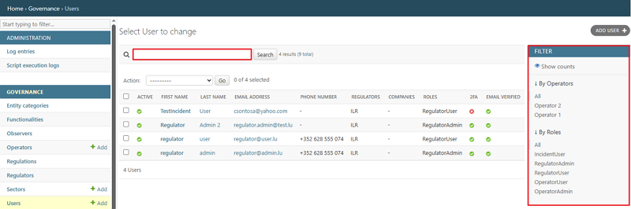

On the **Add User** screen, you can add new users by filling in the required fields (First name, Last name, Email address, and Phone number). The required field (Email address) is indicated with an asterisk. You can create several users by using the **Save and add another** button (circled in red in the screenshot below).

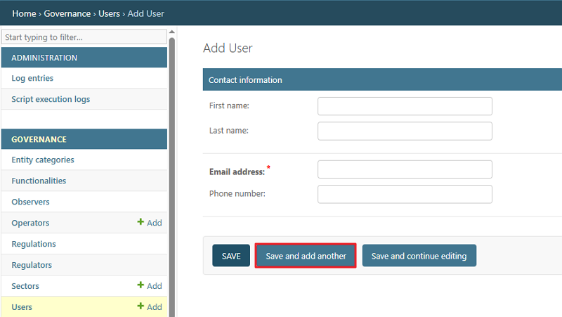

**Please note that as a Regulator Admin, you can only create regulator users and regulator admins (you cannot create operator admins).**

How to filter among users?
"""""""""""""""""""""
Use the Filter section on the far right. The **Show counts** link displays how many users and in what roles can be found in your platform. 

How to reset 2FA?
"""""""""""""""""""""
Choose a user by clicking the checkmark on the far left, before the First Name column. Then, go to the down-pointing arrow in the Action field and choose the option **Reset 2FA**.

How to export selected users?
"""""""""""""""""""""
Choose a user by clicking the checkmark on the far left, before the First Name column. Then, go to the down-pointing arrow in the Action field and choose the option **Export selected users**.

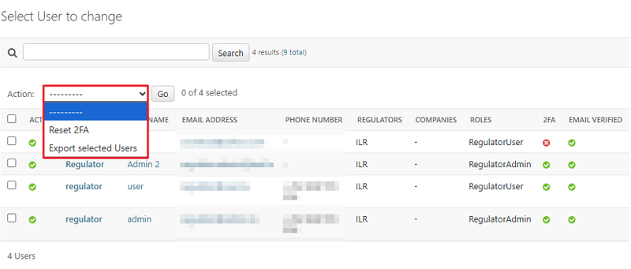

Incident Notification
~~~~~~~~~~~~~~~~~~~~~~~

You should use this section to create your incident notification workflow.

Emails
^^^^^^^^^^^^^^^^^^^^^

By clicking the **Emails** link in the **Incident Notification** section, you can view the email templates that have been set up in your **SERIMA** instance. These email templates are available on the **Select Email to Change** screen and are used during the incident notification workflow.

The email templates are shown as a list in a table with the columns Name, **Subject**, and **Content**.

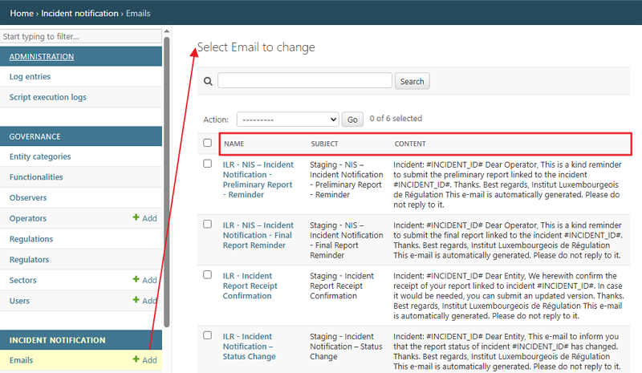

Click the name of the template to see its content. The screenshot below shows an example of the **New Incident Notification** template. You can see the Name, the Subject, and the Content of the email:

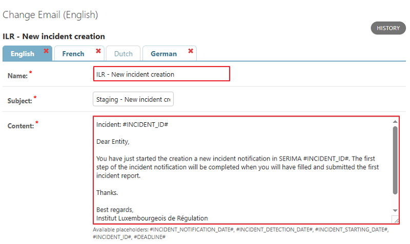

Beneath the Content area, you can see the usable placeholders you can use to replace the relevant information in your template. 

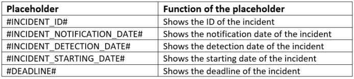

