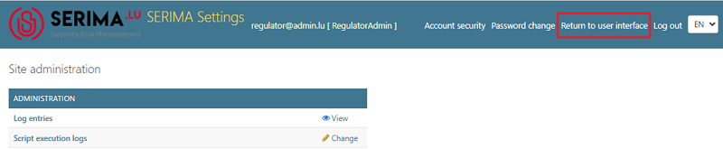
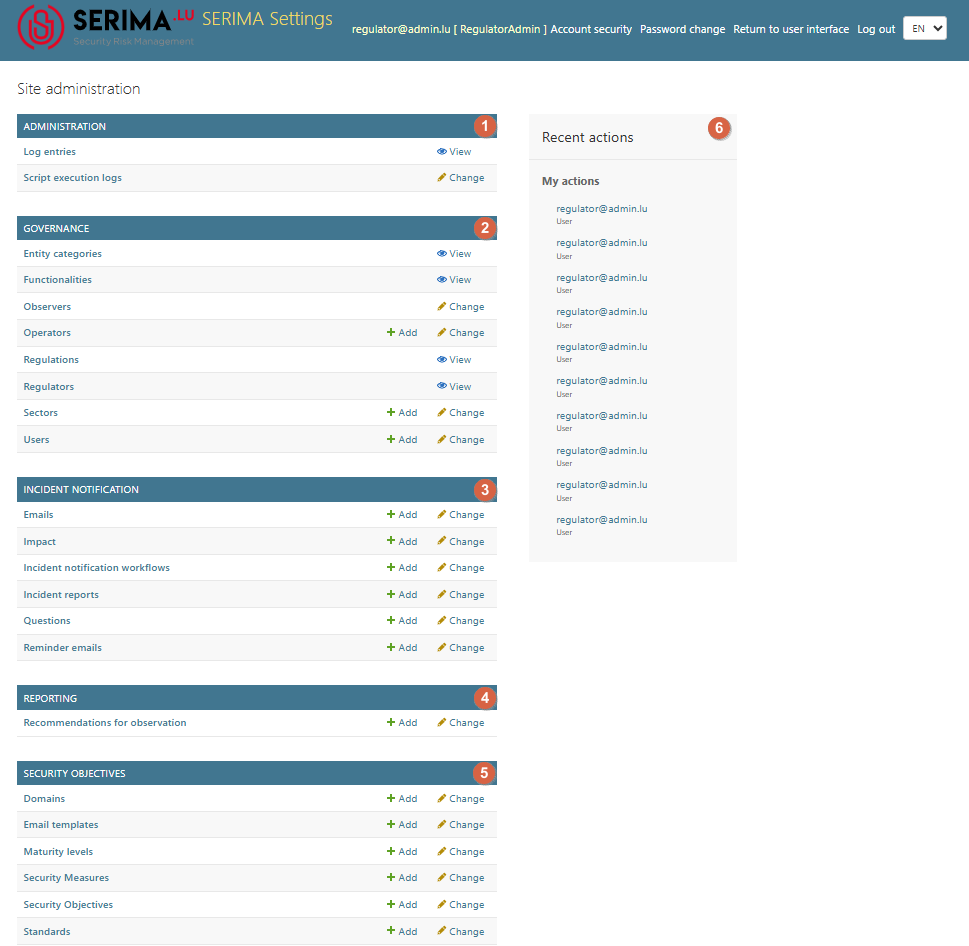

Regulator Admin
-------------------------

In Luxembourg, the regulator is **ILR**. `ILR <https://www.ilr.lu/>`_ can have two types of roles: **Regulator Admin** and **Regulator User**.

The **Regulator Admin** role has permission to create workflows (covering all NIS/EECC-related questionnaires) for users who are required to complete these reports, such as preliminary reports, notifications, and final assessments.

In the user interface, click the **Settings** link to go to the **Site Administration** screen (the Administration Console).
To return to the user interface, click the **Return to user interface** link in the upper right-hand corner (circled in red in the screenshot below).

The **Site Administration screen** (the Administration Interface) offers the most extensive set of features compared with the **Operator Admin**,
**Regulator User**, and **Platform Admin** user types.

The Site administration screen has the following parts: Administration, Governance, Incident Notification, Reporting, Security Objectives, and Recent Actions. In the rest of this chapter, each feature will be discussed in detail.

.. toctree::
   :maxdepth: 2

   administration
   governance
   incident_notification
