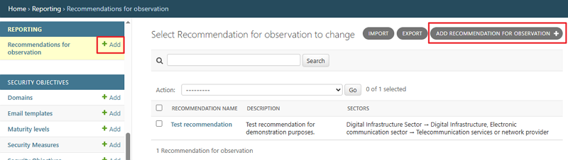
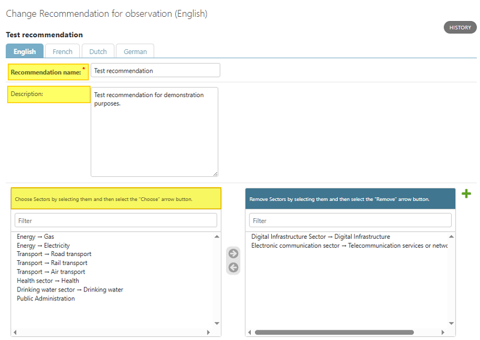

Reporting
~~~~~~~~~~~~~~~~~~~~~~~

The **Reporting** section contains only one menu: **Recommendations for Observation**. This functionality is briefly described in the following chapter.

Recommendations for observation
^^^^^^^^^^^^^^^^^^^^^^^^^^^^^^^^^^^^^^^^^^

Click the **Recommendations for Observation** link to go to the **Select Recommendation for Observation to change** screen. On this screen, you can check what kind of recommendations have been set up. You can add new recommendations either by clicking the **Add** link in the **Reporting** section on the left, or by using the **Add recommendation for observation** button in the top right-hand corner.

The recommendations are displayed in a table with the following columns: **Recommendation, Description**, and **Sectors**. When opening an existing recommendation or creating a new one, these are the fields that must be populated. On the **Change Recommendation for observation** screen, provide a **Recommendation name**, then an optional **Description**, and finally select one or more **Sectors** to which the recommendation applies.

Once the fields are set, click **Save** to store your changes. If you want to create more than one recommendation at a time, click the **Save and add another** button at the bottom of the screen.

You can also **delete a recommendation** by clicking the **Delete** button at the bottom of the **Change Recommendation for observation** screen.
