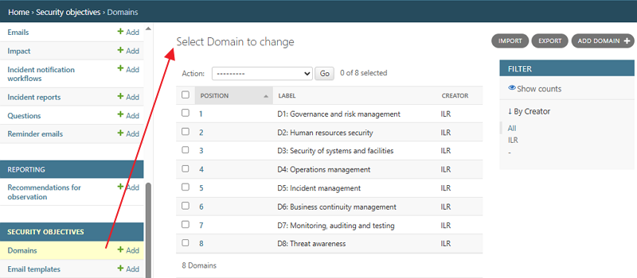
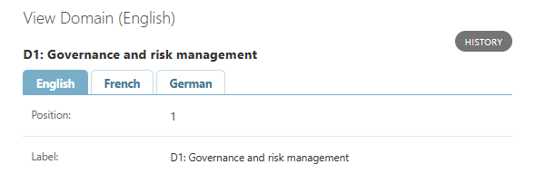
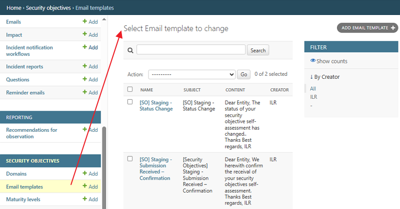

Security Objectives
~~~~~~~~~~~~~~~~~~~~~~~

The security objectives module is a self-assessment tool used to evaluate security objectives and provide evidence of the security measures in place.

In this chapter, you will learn which functionalities are available for a **Regulator Admin** to configure the system, enabling **SERIMA** users to use this functionality on the platform.

Domains
^^^^^^^^^^^^^^^^^^^^^

Click the **Domains** link to go to the **Select Domain to change** screen. On this screen, you can check what kind of domains have been set up. 
You can add new domains either by clicking the **Add** link in the **Security Objectives** section on the left, or by using the **Add Domain** button in the top right-hand corner.

The domains are displayed in a table with the following columns: **Position, Label**, and **Creator**. 
You can delete or export selected domains by using the Actions dropdown menu and choosing the relevant option. You can also use the Import and Export buttons in the top right-hand corner of the screen.

You can view existing domains by clicking the corresponding number in the **Position** column. 
In the **View Domain** screen, you can see the **Position** and **Label** of the selected domain and review its history, if available.

Email templates
^^^^^^^^^^^^^^^^^^^^^

Click the **Email templates** link to go to the **Select Email template to change** screen. 
On this screen, you can check what kind of email templates have been set up. You can add new email templates either by clicking the **Add**
link in the Security Objectives section on the left or by using the **Add Email template** button in the top right-hand corner.

The email templates are displayed in a table with the following columns: **Name, Subject, Content**, and **Creator**. 
You can delete or export selected email templates by using the **Actions** dropdown menu and choosing the relevant option. 

You can view existing email templates by clicking the relevant name of the template in the **Name** column. 
In the **Change Email template** screen, you can see the details of the email template: its **Name, Subject**, and **Content**.

.. figure:: ../_static/regulator_admin_images/Reg_Admin_4.png
   :alt: Change Email template
   :target: /_static/regulator_admin_images/Reg_Admin_48.png

