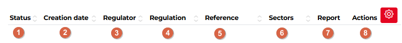
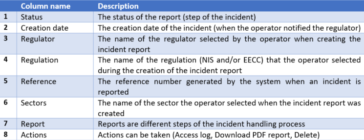
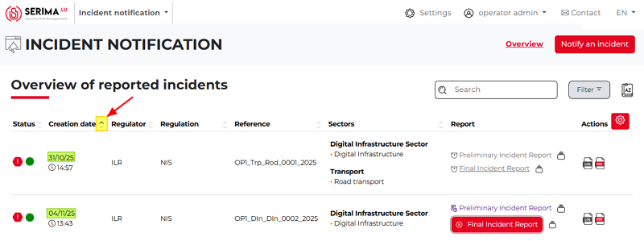

Reported incidents view
----------------------------

The reported incidents view (**Overview of reported incidents** screen) summarizes the list of incidents created by the operator (or end user). 
It is in a table format with the following columns:

The description of the columns is as follows:

When you submit an incident, the system creates a reference. It is a human-readable reference number editable by the regulator regarding the incident.
Each incident is composed of one or several reports. **Reports** are different steps, depending on the options you choose when creating the incident. 
You have to fill in the first report, and after that, you can unlock the second. 

Please note that once you fill in a report, you can see all the historical steps relevant to that report.
Each report has a status: **”Not delivered”, “Delivered but not yet reviewed”, “Review passed”, “Review failed”, and “Not delivered and deadline exceeded”**.

The Incident List View is where you can see the incident reports you sent and the information about them. 
If there are many incidents in the table, you can sort them in alphabetical order using the arrows at the top of the columns. 

Only one sorting aspect can be active at a time, and the active aspect is shown by a darker grey triangle. 
In the screenshot below, the list is sorted by creation date in ascending order (the oldest report is at the top, and the newest report is at the bottom):

In case you see clickable links in the table, you may click on them for further information.
