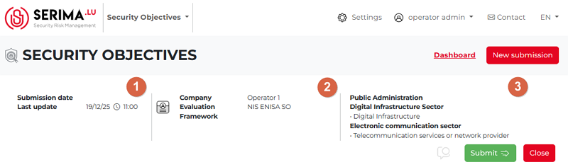
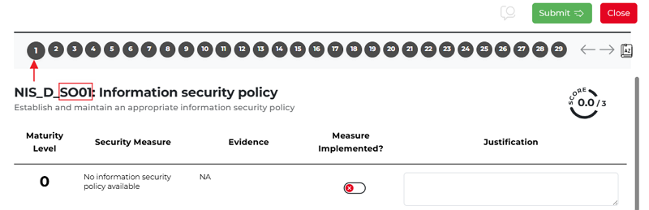

Security Objectives Workflow - Operator Admin
------------------------------------------------

The Operator Admin starts the process. The Security Objectives Dashboard opens, showing 29 forms.
You cannot submit the Security Objective until all 29 forms are saved.
The green **Submit** button is visible but inactive, and the entry remains marked as **Unsubmitted** on the dashboard.

At the top left of the screen (**1**), you can see the **Submission date** (this field remains empty until the entry is submitted)
and the **Last update** field.

To the right (**2**), the name of the **Company** submitting the security objective and the **Evaluation Framework** to be used are displayed.

The third column (**3**) in the header shows the names of the sectors selected by the Operator Admin in the initial pop-up
when creating the security objective.

Beneath the header section, you can see the Comment, Submit, and Close buttons.
You can see the form numbers (1-29) in grey when you open a security objective entry.

The active form is indicated by a slightly larger icon than the others.
In the screenshot below, the first form is active, as shown by its slightly larger icon.
Below the row of icons, you can see that this is the first form and its topic.

The **Operator** should fill in all 29 forms to be able to submit the **Security Objective** entry for the **Regulator**.
