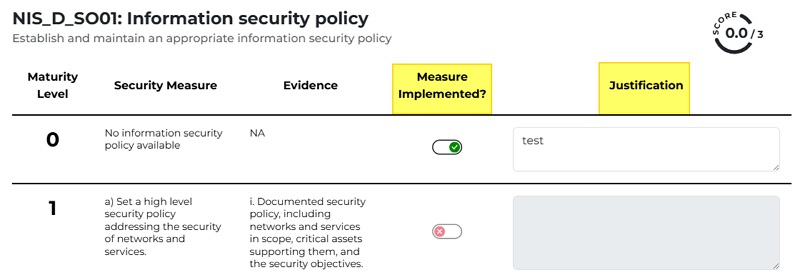
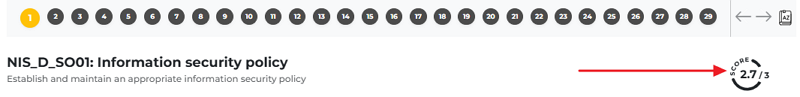
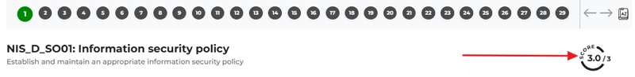

Security Objectives Workflow
-------------------------------
  
Before we dive into the workflow, let’s discuss how the scoring system works. In the next chapter, you can read a short explanation.

How does the Score system work?
~~~~~~~~~~~~~~~~~~~~~~~~~~~~~~~~~

On each form, you can indicate the security measures in place, which correspond to your maturity level. 
Each form has four maturity levels, ranging from 0 to 3. 

Use the sliders in the **Measures Implemented** column to show the measures you have taken, and in the Justification column, 
you can explain why you believe you have reached that maturity level.

The number of sliders in the **Measures Implemented** column may vary for each maturity level. 
However, if all sliders within a given maturity level are green, that level is worth one point.
If a maturity level has two sliders, each green slider is worth 0.5 points. 
For a maturity level with three sliders, the total value is 1 point if all are green; otherwise, each green slider is worth 0.3 points. 
For maturity level 3 with only one slider, setting it to green is worth a full point. If any maturity level is completed, you get one point.

If you reach 3 points out of three, the form indicator turns from yellow to green.

47

