Security Objectives Workflow - Regulator Admin
------------------------------------------------
When a regulator receives a **Security Objectives** submission, its status is **Under review**, and its progress is **0%**. 
These indicators show that a new entry has arrived and should be reviewed.

The regulator can also see when the declaration was submitted in the **Submission date** column, or sort the entries so 
that the most recent submissions appear at the top of the list.

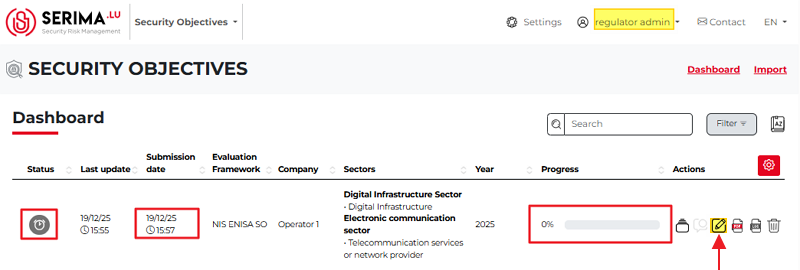

The **Regulator admin** clicks the **Review** button (highlighted in yellow and marked with a red arrow above). 
The selected Security Objective declaration opens, and the Regulator admin can start checking and reviewing its content.

The Regulator Admin cannot change the sliders or the content of the **Justification** or **Planned Measures** fields. 
The Regulator Admin can only use the **Review comment** column to add comments to the entry.

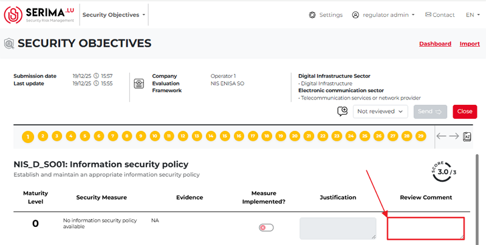

The Regulator Admin reviews the content, adds comments, and decides whether the form of the Security Objectives is 
approved (**Passed**) or rejected (**Fail**) by selecting the appropriate value from the drop-down menu.

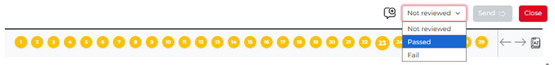

The **Regulator Admin** should review each form (by selecting either the **Passed** or **Fail** options from the drop-down menu) so that the Send button becomes active and turns green.

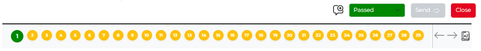

The Regulator Admin approves the declaration
~~~~~~~~~~~~~~~~~~~~~~~~~~~~~~~~~~~~~~~~~~~~~~~

If the **Regulator Admin** approves all forms by selecting **Passed** from the drop-down menu (so that the forms turn green), the Send button becomes active, and the Regulator Admin can send the approved Security Objective declaration back to the **Operator Admin**.

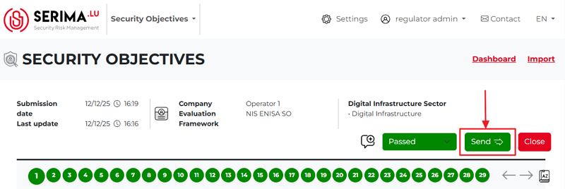

Once the Regulator Admin clicks **Send** and writes a comment, the Dashboard changes (marked with red arrows):

-	A note appears at the top of the screen.
-	The status icon of the entry turns green, and when the Regulator Admin hovers over it, a pop-up message appears saying **Passed and sent**.
-	The review comment icon changes, and the speech bubble shows a blue dot.

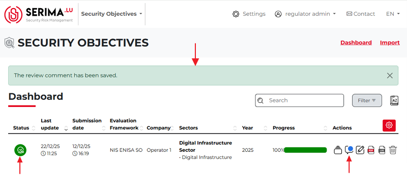

By clicking the Send button, the content of the Security Objectives has been sent to the **Operator Admin**.

**The Operator Admin receives the feedback, and the Security Objectives entry will show the changes:**

-	The status icon of the entry turns green, and when the Operator Admin hovers over it, a pop-up message appears saying **Passed**.
-	The review comment icon changes, and the speech bubble shows a blue dot.

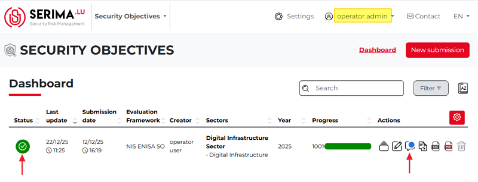

The review comment contains the **Regulator’s comment**. If the Operator Admin clicks the review comment icon, a pop-up appears showing the review status, the Regulator’s comment, and the deadline field.

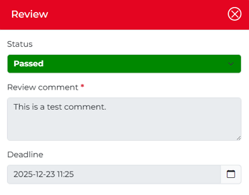

In this case, the Operator Admin has nothing more to do, as **the Security Objective declaration has been accepted by the Regulator Admin**.
However, not all declarations can be accepted by the Regulator Admin. In the following chapter, we will see what happens when, for any reason, the declaration is rejected, and the Operator Admin must fix the issues.

The Regulator Admin denies the declaration
~~~~~~~~~~~~~~~~~~~~~~~~~~~~~~~~~~~~~~~~~~~~~~

If any of the forms fail, the **Security Objective declaration fails**. In the screenshot below, Forms 2, 5, and 13 failed; therefore, their form numbers are shown in red. These forms were denied by the Regulator Admin, and the relevant comments explaining the reasons for failure were added to the **Review Comment pop-ups.

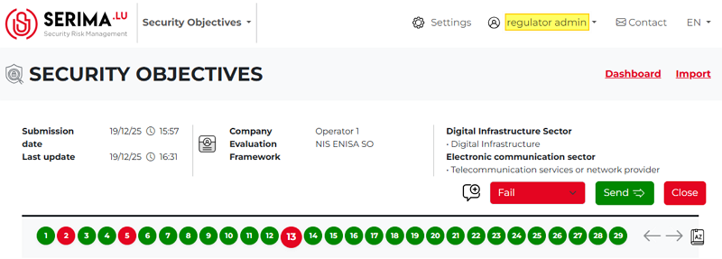

If the Regulator Admin clicks the Send button, the **Review pop-up** appears (as shown in the screenshot below), where the Regulator Admin can enter a review comment and set a deadline by which the identified deficiencies must be corrected or fixed.

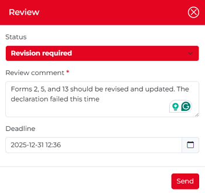

If the Regulator Admin clicks the Send button and finalizes their decision, they will be taken to the dashboard, where they can see the following changes:

-	A note appears at the top of the screen.
-	The status icon of the entry turns red, and when the Regulator Admin hovers over it, a pop-up message appears saying **Revision required and sent**.
-	The review comment icon changes, and the speech bubble shows a blue dot.

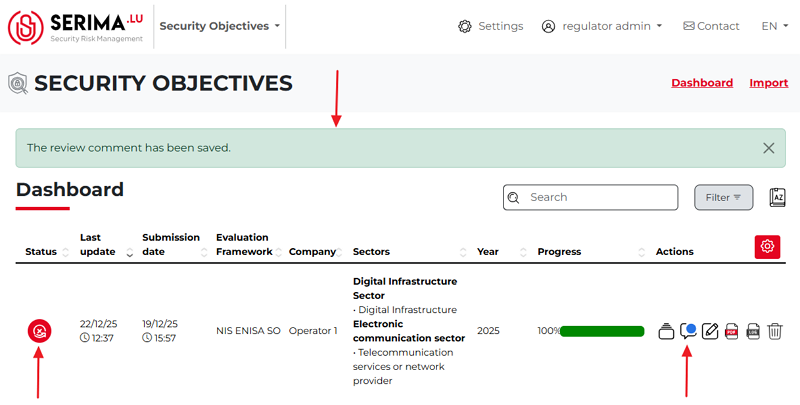

The Operator Admin receives the failed Security Objectives declaration. When the Operator Admin logs in and there is a failed entry, the Admin can see a white **X icon** on a red circular background in the **Status** column of the dashboard. 
In addition to the Status icon, the **blue dot** on the Review Comment icon indicates that **there is a comment** explaining the denial.

