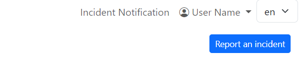
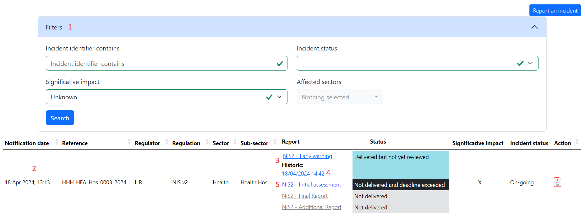

User interface
=====================

log-in
-------

On this page you can log in or create an account in case you have to notify an incident and you don't have your credential.

.. figure:: _static/ui_user_login_page.png
   :alt: Login page.
   :target: _static/ui_user_login_page.png

   Screenshot of the login page.

If you have credentials and don't remember the password please use the link: 'Forgotten your password or username?'

At the first login, you need to activate the 2FA.

Notify an incident (available for concerned profiles)
--------------------------------------------------------

Once logged in you can notify an incident by clicking on the dedicated button 'report an incident'

Complete all the step until the last one, and the application will create the incident(s) depending of your inputs.

Incident list view for operators
------------------------------------------

The default login page when you are a user is the incident list view. You can find here all your incident. 

   Screenshot of the list of incidents from the user view.

1. You can filter all your incident and expend/collapse the filters area
2. This is one record for one incident, you can find all the information, status, and download a summary of the incident in PDF 
3. In this example you can resubmit the early warning
4. In this example you have already submitted an early warning and can consult it 
5. You can fill the Initial assessment, the other steps are not accessible because you need to fill the previous one

Incident list view for regulators
------------------------------------------

The default login page when you are a user is the incident list view. You can find here all the incidents that concerns you. 

.. figure:: _static/screenshot_incidents-page.png
   :alt: Screenshot of the list of incidents from the user view.
   :target: _static/ui_screenshot_incidents.png

   Screenshot of the list of incidents from the regulator view.

It's the same view as that of the operators, except you can directly edit some fields:

- Reference of the incident
- Report status
- Incident status
- significative impact

