User interface
=====================

The login page
---------------

On this page you can log in or create an account in case you have to notify an incident and you don't have credentials.

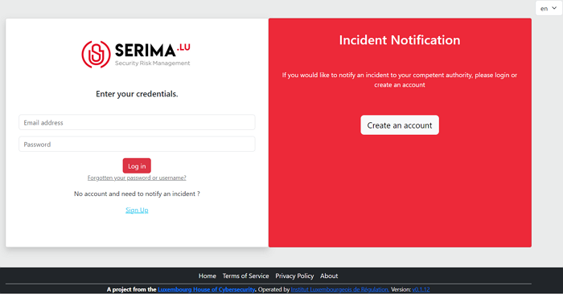

   Screenshot of the login page.

If you already have an account, please use the left pane and enter your credentials (email address and password) to log in. 

In case you have forgotten your password or username, please click on the link below the 'Log in' button that says '**Forgotten your password or username?**'.

If you do not have an account, please click on the '**Sign Up**' link on the left pane, or use the right pane and click on the '**Create an account**' button. Both options will take you to the account creation page.

Create an account
------------------

If you do not have an account yet, create one by using the '**Sign Up**' link on the left or the '**Create an account**' button on the right. Populate the required fields and provide a password you would like to use.

Please note that the following password restrictions apply:

* Your password can’t be too similar to your other personal information.
* Your password must contain at least 8 characters.
* Your password can’t be a commonly used password.
* Your password can’t be entirely numeric.

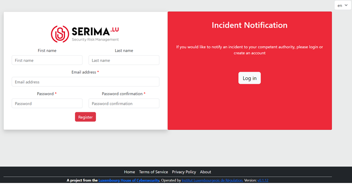

   Create an account

Enable two-factor authentication
---------------------------------

Once you click on '**Register**', you are logged into the SERIMA Platform. Since this is your first login, the system suggests you to enable the two-factor authentication. Click on the button '**Enable Two-Factor Authentication**'.

.. figure:: _static/SER_3.png
   :alt: 2FA.
   :target: _static/SER_3.png

   2FA

Follow the steps in the wizard to enable 2FA: first, click on the '**Next**' button.

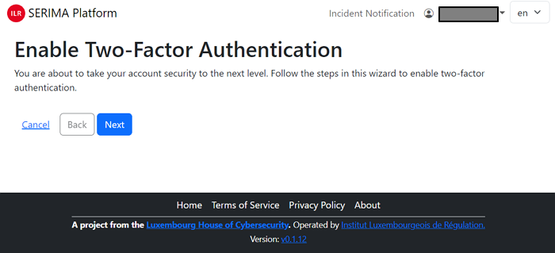

   2FA

Then either use your smartphone and scan the QR code from the screen or use the long character set called TOTP Secret to set up TOTP in your authenticator or password manager manually. As the last step, please enter the token (a six-digit number) into the Token field and click '**Next**'.

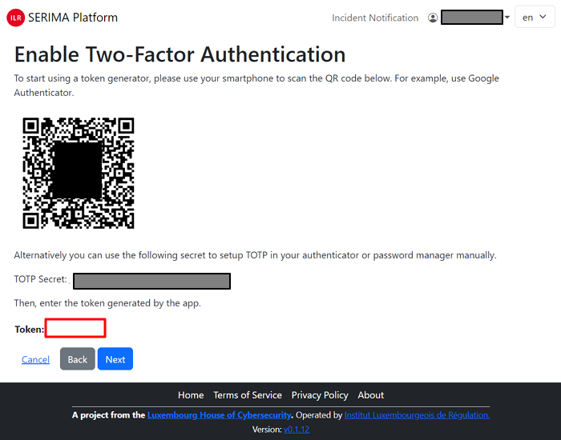

   2FA

In case you have successfully enabled two-factor authentication, you are greeted with the below screen:

.. figure:: _static/SER_6.png
   :alt: 2FA.
   :target: _static/SER_6.png

   2FA

Please click on the grey button and log in again. Provide your email address and password and click on '**Log in**'. Then, open your authenticator app on your smartphone and type in the randomly generated Token and click '**Log in**'.

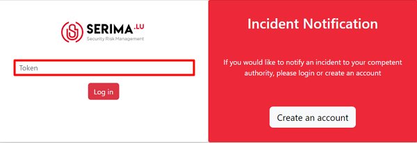

   2FA

As an '**Operator**' or '**User**', this is your main page where you land whenever you open this application. 
Since this is your first login, there is no incident displayed in the incident dashboard.

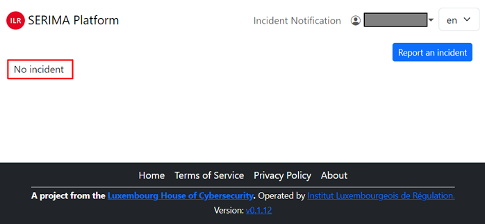

The Platform is straightforward. Use the '**ILR SERIMA Platform**' link in the top-left corner to come back to the main page at any time. 

In the top right-hand corner, you can see your name with a drop-down menu. If you click on the down-pointing arrow, the following dropdown menu appears:

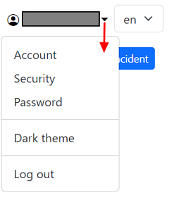

* **Account**: you may change your first name, last name, and phone number.

* **Security**: you can change your security settings. You can create backup tokens in case you do not have any device with you (you can access your account using backup tokens). You can also disable two-factor authentication, but this is strongly not recommended.

* **Password**: you can change your password here. You must enter your old password and type in twice the new one you would like to use (please observe the restrictions on creating a new password).

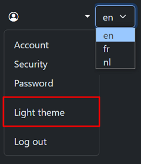

* **Dark theme/Light theme**: you can switch between a dark and light background by using this link. 

* **Log out**: use this link to log out from the application. In case you are not active, the system will log you out for security reasons.

* **Language separator**: in the top right-hand corner, you can switch between English (en), French (fr) and Dutch (nl) languages.

Report an incident 
-------------------

The main function of this module is to make it possible for you to report incidents. To report an incident, click on the ’Report an incident’ button in the top right-hand corner:

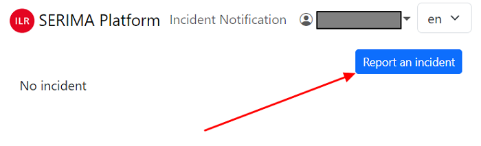

Contact
~~~~~~~~

The '**Contact**' form appears. Please fill in the required fields, so the authorities to whom you are sending the incident report can get back to you. The form has three main parts:

1. **Person in charge of the incident notification**: name, job title, email, telephone
2. **Technical contact** (if the same person, please activate the slider, so it will be blue)
3. **References** (Optional): Incident reference, Complaint reference

The below screenshot is only a fictitious example for demonstration purposes:

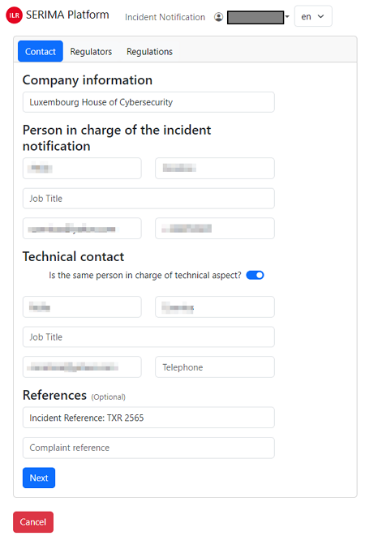

Regulators
~~~~~~~~~~~~

The next page is the '**Regulators**'. Here, you can choose among the list items to which regulator you want to report the incident. You may choose several regulators by putting a tick mark in the checkboxes in front of the list items:

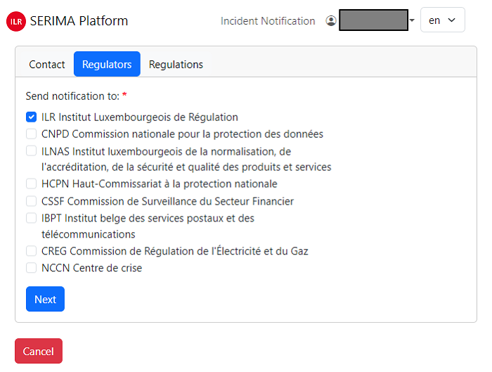

Regulations
~~~~~~~~~~~~

The following step is to define which regulation/s you want to refer to. Again, you may choose both.

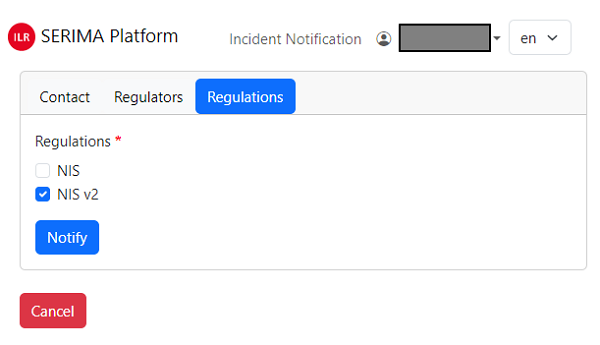

Sectors
~~~~~~~~~

Then you should define which sector is affected by the incident. The options are very straightforward and you may choose more sectors. As many sectors as you have marked, as many incidents will be created in the system.

For demonstration purposes, let's choose two sectors (Energy-Electricity and Digital Infrastructure Telecommunications):

.. figure:: _static/SER_15.png
   :alt: Sector form.
   :target: _static/SER_15.png

Detection date
~~~~~~~~~~~~~~~

As the final step in the incident reporting process, you should provide the date and time of the incident. The easiest way to populate the required field is to click on the calendar icon (the field will be automatically populated with the date and time of detection).

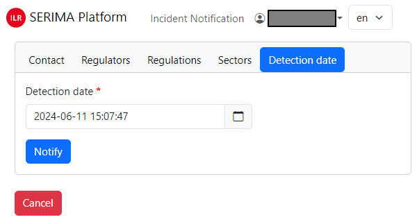

If the detection date field is filled in correctly, click the '**Report**' button to complete the incident reporting process. You will be directed back to the main screen (Incident List View) where you can see the newly created incident reports.

The table contains, on the one hand, the items that you filled in during the preparation of the incident report, as well as new columns: for example, the Significant impact, the Incident status, or the Action columns.

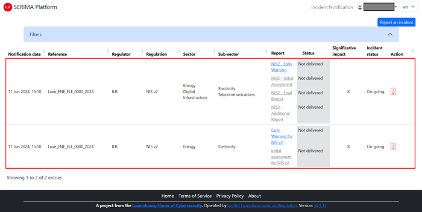

This is the page (**Incident List View**) where you can see the incident reports you sent and the information about them. If there are many incidents in the table, you can sort them in alphabetical order using the arrows at the top of the columns. Only one sorting criteria can be activated at a time and the active sorting criteria is shown by a darker grey triangle:

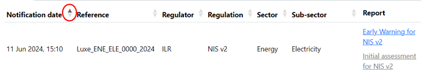

In case you see clickable links in the table (for instance ’NIS2 – Early Warning’ in the above screenshot), you may click on them for further information.

Incident list view 
~~~~~~~~~~~~~~~~~~~

The **Incident List View** is the main screen of the application: this is the view that summarizes the list of incidents created by the operator (or end user). It is in a table format with the following columns:

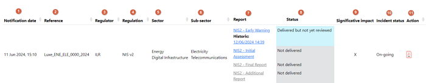

The description of the columns is as follows:

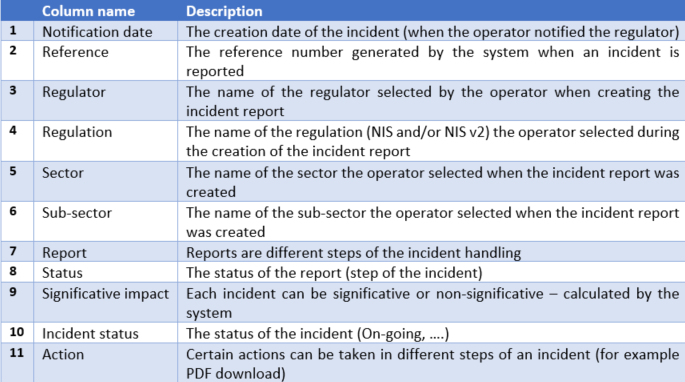

When you submit an incident, the system creates a reference. It is a human readable reference number editable by the regulator regarding the incident.

Each incident is composed of one or several reports. Reports are different steps, depending on the options you choose when creating the incident. You have to fill in the first report and after you can unlock the second. Please note that once you fill in a report, you can see all the historic steps.

Each report has a status: '**Not delivered**', '**Delivered but not yet reviewed**', '**Review passed**', '**Review failed**' and '**Not delivered and deadline exceeded**'.

Search among incidents
~~~~~~~~~~~~~~~~~~~~~~~~

The filter function of the platform can be very useful if there are many incidents and you want to filter among them according to different criteria to find the incident you are looking for.

To make the filters visible, click on the down-pointing arrow at the right end of the filter field:

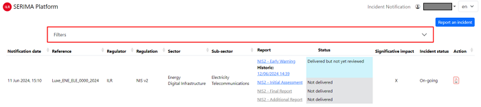

You can filter all your incidents and expand/collapse the filter area. The filter can be used with the following search fields:

- **Incident identifier contains**: this is a free-word search engine that can be used to search among incident identifiers by character strings.
- **Significative impact**: this field searches among the values of the Significative impact, which can have two values (yes or no). The '**X**' in the screenshot above corresponds to the value '**NO**' in the Significative Impact column.
- **Incident status**: The Incident status is also a Boolean data type, it can take only two values: '**Closed**' or '**On-going**'.
- **Affected sectors**: you can search among the affected sectors here, by clicking on the down-pointing arrow (a list of possible sectors appears, so you can search for a specific sector).

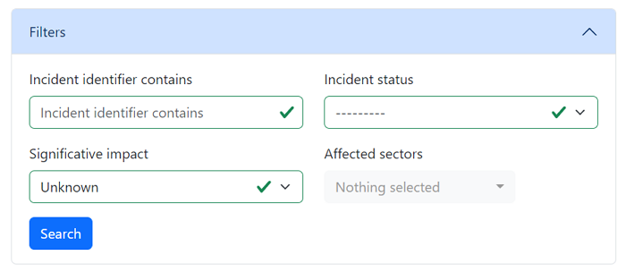

Security Obejctives 
---------------------

The security objective self-assessment is accessible by clicking on the menu at the top of the page. 

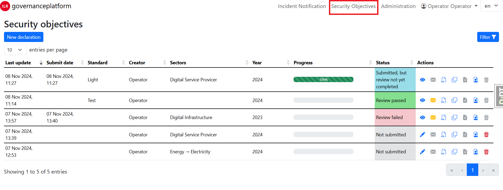

If you already had some security objective reported, you can have a list like the above. Else you need to declare a new one by clicking on the blue button **New declaration**

The list is similar to the incident one. The only difference is that you have to submit your declaration by clicking on the green icon in the action menu. 

.. figure:: _static/SO_05.png
   :alt: Action menu.
   :target: _static/SO_05.png

The action menu above is the one before the submission:

- The **blue pen** is to fill the security objective. It goes to an eye to see the security objectives when the security objectives are submitted
- The **envelope** is going to orange when you get a message from the competent authority 
- The **PDF file** is here to generate a PDF file
- The **fourth icon** is here to duplicate a security objective. It allows us to start a new evaluation from a previous one
- The **file with the arrow** is here to submit the evaluation. When the evaluation is submitted, it's impossible to resubmit or edit
- The **icon with the portrait** is here to see who has accessed to the evaluation 
- The **garbage icon** is to delete an evaluation while it's not submitted

Declare a new security objective
~~~~~~~~~~~~~~~~~~~~~~~~~~~~~~~~~

After clicking, a nice pop-up appears, you have to choose the referential, the sectors and the year. 

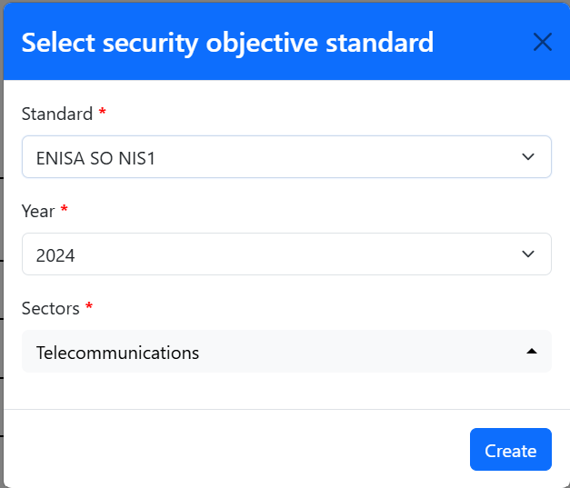

Click on the blue button **create** and the standard is created and you are redirected to the page to fill all the security objectives. If you want to go back to the list view of all your creations, please use the menu at the top. 

Fill a security objective (SO)
~~~~~~~~~~~~~~~~~~~~~~~~~~~~~~~~~

This is the page to fill a SO. At the top you have the list of all the security objectives.

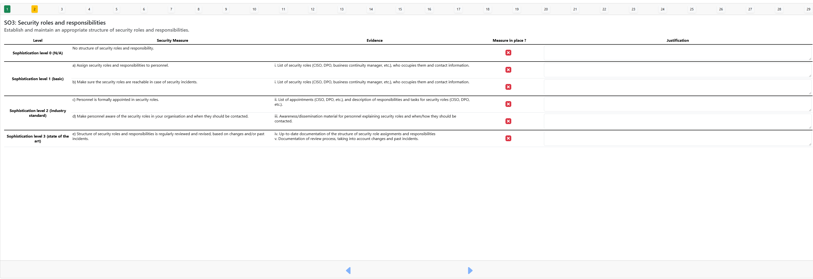

As you can see, security objectives can have 3 states: 

- **Green** correctly filled
- **Orange** filled but some information are missing
- **Blank** not filled 

You have to tick the "measure in place" and put a justification to go to the green, you can switch between the different SO by clicking on the number or using the blue arrow at the bottom of the page. 

